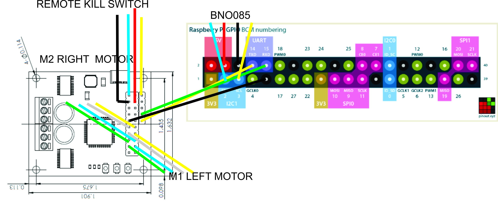
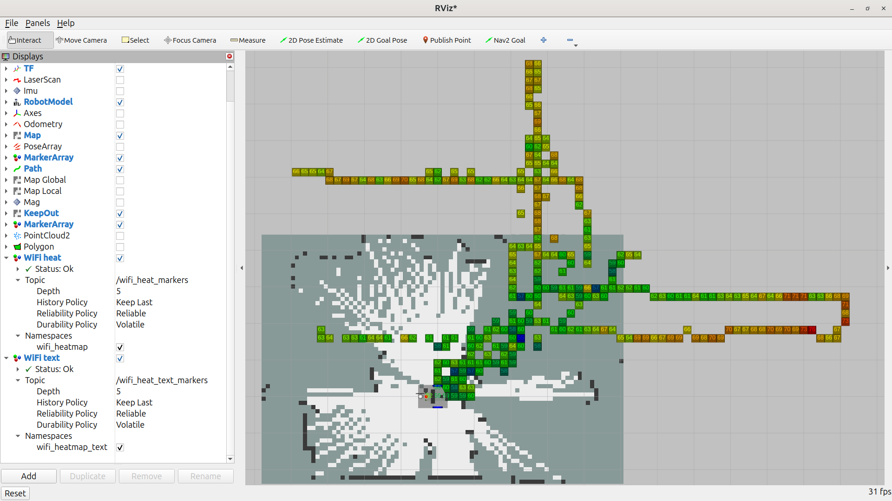
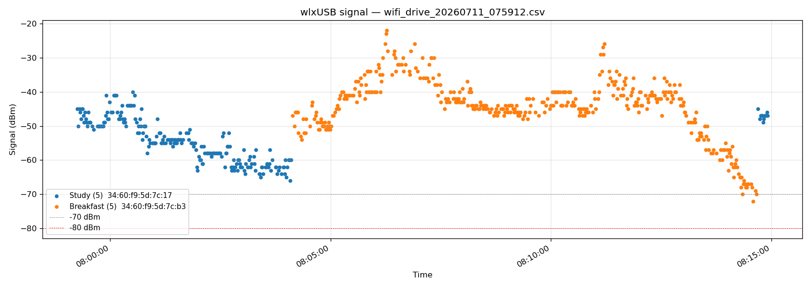

# Stormy the Stingray - Builder's Manual

Version 1.1 - Compiled 2026-07-20; public release 2026-09-11.

If the SD card dies tomorrow, this document is how Stormy gets rebuilt.
Present-tense, imperative, subsystem-oriented.  Every procedure is one
that has been executed successfully on the real robot.

- **Owner:** James H Phelan, MD (Humble, TX).
- **Status:** Public.  Values in `<ANGLE_BRACKETS>` throughout are
  placeholders for reader-specific local values (LAN IPs, SSIDs, MAC
  addresses, house dimensions, dock offsets).  See the "Placeholder
  key" block in [`Stingray_Builders_Manual.txt`](Stingray_Builders_Manual.txt).
- **License:** CC BY 4.0 (see [License](#license) at the bottom).

## Companion files in this repo

| File | Purpose |
| --- | --- |
| [`Stingray_Builders_Manual.txt`](Stingray_Builders_Manual.txt) | **Source of truth.** Plain-text master copy of this document.  All edits go here first; `README.md` is regenerated from it (see [Regenerating this README](#regenerating-this-readme)). |
| [`Stingray_Field_Notes.txt`](Stingray_Field_Notes.txt) | 105 numbered lessons + indexes distilled from the source log.  Cited throughout the Manual by item number. |
| [`Stingray_Curation_Notes.txt`](Stingray_Curation_Notes.txt) | 17 chunks of raw stardated distillate from the source log.  Background material for the Manual. |
| [`kicad/Stingray/`](kicad/Stingray/) | KiCad 10.0 project - schematic, custom symbol library, PCB stub.  Source for Appendix [G.9](#g9--stormy-schematic-2026-08-12png). |
| [`images/`](images/) | Diagrams and photos catalogued in [Appendix G](#appendix-g---diagrams-and-photos). |
| [`tools/build_readme.py`](tools/build_readme.py) | Regenerates this `README.md` from the `.txt`. |
| [`LICENSE`](LICENSE) | CC BY 4.0 legal text. |

The source log (`Stingray Experience.wpd`, 832 pp WordPerfect) is
**not** in this repo -- it is the private working diary this Manual
and the two companion `.txt` files were distilled from.

## Companion repositories

The Manual references code and configuration living in these repos:

- **Build descriptor:** <https://github.com/JHPHELAN/stingray>
- **Software (main):** <https://github.com/JHPHELAN/articubot_one>
    - `jp` branch -- main software (fork of slgrobotics's fork of
      Articulated Robotics' `articubot_one`)
    - `exploration` branch -- house exploration + mapping code
      (currently running on Stormy; not yet merged to `jp`)
- **Motor driver:** <https://github.com/JHPHELAN/roboclaw_driver>
    (fork of wimblerobotics/roboclaw_driver)
- **Dotfiles (private):** <https://github.com/JHPHELAN/stingray-dotfiles>

## Regenerating this README

`Stingray_Builders_Manual.txt` is the source of truth.  `README.md`
is mechanically generated from it by
[`tools/build_readme.py`](tools/build_readme.py).  To port a `.txt`
edit into the rendered manual:

```bash
python3 tools/build_readme.py
```

Then commit both files together.


## Table of contents

- [CHAPTER 0 - HOW TO USE THIS MANUAL](#chapter-0---how-to-use-this-manual)
- [CHAPTER 1 - ORIGIN](#chapter-1---origin)
- [CHAPTER 2 - CURRENT HARDWARE SUMMARY](#chapter-2---current-hardware-summary)
  - [2.1  Physical dimensions and mass](#21--physical-dimensions-and-mass)
  - [2.2  Power (see Chapter 3)](#22--power-see-chapter-3)
  - [2.3  Drivetrain (see Chapter 4)](#23--drivetrain-see-chapter-4)
  - [2.4  Compute (see Chapter 5)](#24--compute-see-chapter-5)
  - [2.5  IMU (see Chapter 6)](#25--imu-see-chapter-6)
  - [2.6  LiDAR (see Chapter 7)](#26--lidar-see-chapter-7)
  - [2.7  Camera (see Chapter 8)](#27--camera-see-chapter-8)
  - [2.8  Network (see Chapters 9 and 18)](#28--network-see-chapters-9-and-18)
- [CHAPTER 3 - POWER SYSTEM](#chapter-3---power-system)
  - [3.1  Topology (target, 2026-09; rewire in progress)](#31--topology-target-2026-09-rewire-in-progress)
  - [3.2  Emergency stop + remote kill switch (two distinct devices)](#32--emergency-stop--remote-kill-switch-two-distinct-devices)
  - [3.3  Shunt Regulator - Pololu 3779](#33--shunt-regulator---pololu-3779)
  - [3.4  Common power symptoms and fixes](#34--common-power-symptoms-and-fixes)
- [CHAPTER 4 - DRIVETRAIN](#chapter-4---drivetrain)
  - [4.1  Motors](#41--motors)
  - [4.2  Encoders](#42--encoders)
  - [4.3  Wiring - motors and encoders](#43--wiring---motors-and-encoders)
  - [4.4  RoboClaw configuration](#44--roboclaw-configuration)
  - [4.5  PID tuning](#45--pid-tuning)
  - [4.6  Driver package](#46--driver-package)
  - [4.7  Twist vs TwistStamped](#47--twist-vs-twiststamped)
  - [4.8  Per-board main-battery voltage calibration](#48--per-board-main-battery-voltage-calibration)
- [CHAPTER 5 - COMPUTE (Raspberry Pi 5)](#chapter-5---compute-raspberry-pi-5)
  - [5.1  Hardware](#51--hardware)
  - [5.2  UART configuration for RoboClaw](#52--uart-configuration-for-roboclaw)
  - [5.3  EEPROM and boot configuration](#53--eeprom-and-boot-configuration)
  - [5.4  Diagnostic commands (adopted from Sergei)](#54--diagnostic-commands-adopted-from-sergei)
- [CHAPTER 6 - IMU (BNO085)](#chapter-6---imu-bno085)
  - [6.1  Hardware](#61--hardware)
  - [6.2  Driver](#62--driver)
  - [6.3  Configuration](#63--configuration)
  - [6.4  EKF integration](#64--ekf-integration)
  - [6.5  Verification](#65--verification)
- [CHAPTER 7 - LIDAR (Youyeetoo FHL-LD19)](#chapter-7---lidar-youyeetoo-fhl-ld19)
  - [7.1  Hardware](#71--hardware)
  - [7.2  udev rule (persistent device name)](#72--udev-rule-persistent-device-name)
  - [7.3  Driver](#73--driver)
  - [7.4  Launch and static TF](#74--launch-and-static-tf)
  - [7.5  SLAM Toolbox / Nav2 usage](#75--slam-toolbox--nav2-usage)
- [CHAPTER 8 - CAMERA (Luxonis OAK-D)](#chapter-8---camera-luxonis-oak-d)
  - [8.1  Hardware](#81--hardware)
  - [8.2  Driver install](#82--driver-install)
  - [8.3  Configuration](#83--configuration)
  - [8.4  Nav2 obstacle source](#84--nav2-obstacle-source)
  - [8.5  Mesh and material](#85--mesh-and-material)
- [CHAPTER 9 - NETWORKING](#chapter-9---networking)
  - [9.1  Interfaces (current, 2026-07-20)](#91--interfaces-current-2026-07-20)
  - [9.2  Disabling wlan0](#92--disabling-wlan0)
  - [9.3  TP-Link Deco mesh layout](#93--tp-link-deco-mesh-layout)
  - [9.4  WiFi monitoring](#94--wifi-monitoring)
- [CHAPTER 10 - BASE OS INSTALL AND ROS 2 JAZZY SETUP](#chapter-10---base-os-install-and-ros-2-jazzy-setup)
  - [10.1  OS](#101--os)
  - [10.2  System updates and base tools](#102--system-updates-and-base-tools)
  - [10.3  UART configuration](#103--uart-configuration)
  - [10.4  ROS 2 Jazzy install](#104--ros-2-jazzy-install)
  - [10.5  ROS 2 environment vars](#105--ros-2-environment-vars)
  - [10.6  Additional apt packages needed](#106--additional-apt-packages-needed)
  - [10.7  SSH keys and Git](#107--ssh-keys-and-git)
- [CHAPTER 11 - WORKSPACE, REPOS, AND BUILD](#chapter-11---workspace-repos-and-build)
  - [11.1  Workspace layout](#111--workspace-layout)
  - [11.2  Clone all repos](#112--clone-all-repos)
  - [11.3  rosdep and build](#113--rosdep-and-build)
  - [11.4  Common build issues](#114--common-build-issues)
- [CHAPTER 12 - URDF AND ROBOT DESCRIPTION](#chapter-12---urdf-and-robot-description)
  - [12.1  Xacro file tree](#121--xacro-file-tree)
  - [12.2  Key physical dimensions (from stingray_properties.xacro)](#122--key-physical-dimensions-from-stingray_propertiesxacro)
  - [12.3  Wheel link split (RViz2 multi-visual bug workaround)](#123--wheel-link-split-rviz2-multi-visual-bug-workaround)
  - [12.4  base_footprint size (accounts for OAK-D nose)](#124--base_footprint-size-accounts-for-oak-d-nose)
  - [12.5  Mesh files](#125--mesh-files)
- [CHAPTER 13 - NAV2, SLAM TOOLBOX, AMCL CONFIGURATION](#chapter-13---nav2-slam-toolbox-amcl-configuration)
  - [13.1  Config files](#131--config-files)
  - [13.2  Nav2 footprint (polygon, 9-vertex)](#132--nav2-footprint-polygon-9-vertex)
  - [13.3  Heading overshoot fix (2026.04.12)](#133--heading-overshoot-fix-20260412)
  - [13.4  Costmap frequencies (Pi 5 tuning)](#134--costmap-frequencies-pi-5-tuning)
  - [13.5  KeepOut filter (for coffee-table zones)](#135--keepout-filter-for-coffee-table-zones)
  - [13.6  SLAM Toolbox](#136--slam-toolbox)
  - [13.7  AMCL (production localization)](#137--amcl-production-localization)
  - [13.8  Timestamp cache errors - diagnostic chain](#138--timestamp-cache-errors---diagnostic-chain)
- [CHAPTER 14 - MAPPING WORKFLOW (BLUEPRINT + HYBRID)](#chapter-14---mapping-workflow-blueprint--hybrid)
  - [14.1  The mapping problem](#141--the-mapping-problem)
  - [14.2  blueprint_to_pgm.py - one-time setup](#142--blueprint_to_pgmpy---one-time-setup)
  - [14.3  Room-by-room mapping cycle](#143--room-by-room-mapping-cycle)
  - [14.4  Loop closure discipline](#144--loop-closure-discipline)
  - [14.5  Loading and using the map for production nav](#145--loading-and-using-the-map-for-production-nav)
- [CHAPTER 15 - AUTONOMOUS EXPLORATION](#chapter-15---autonomous-exploration)
  - [15.1  Tool](#151--tool)
  - [15.2  Key parameters](#152--key-parameters)
  - [15.3  Known issue: cold-start deadlock](#153--known-issue-cold-start-deadlock)
  - [15.4  Usage](#154--usage)
- [CHAPTER 16 - INDICATORS](#chapter-16---indicators)
  - [16.1  Purpose](#161--purpose)
  - [16.2  Hardware (Rev 3, current)](#162--hardware-rev-3-current)
  - [16.3  Node](#163--node)
  - [16.4  WAV file preparation](#164--wav-file-preparation)
- [CHAPTER 17 - THREE-MACHINE OPERATION](#chapter-17---three-machine-operation)
  - [17.1  Machines](#171--machines)
  - [17.2  Standard launch order](#172--standard-launch-order)
  - [17.3  Common gotchas](#173--common-gotchas)
- [CHAPTER 18 - CYCLONEDDS UNICAST PEER DISCOVERY](#chapter-18---cyclonedds-unicast-peer-discovery)
  - [18.1  Why this exists](#181--why-this-exists)
  - [18.2  Config file](#182--config-file)
  - [18.3  Environment](#183--environment)
  - [18.4  Adding a third host](#184--adding-a-third-host)
- [CHAPTER 19 - DAILY OPERATIONS](#chapter-19---daily-operations)
  - [19.1  Bash aliases (~/.bash_aliases)](#191--bash-aliases-bash_aliases)
  - [19.2  Environment (~/.bashrc appended)](#192--environment-bashrc-appended)
  - [19.3  ~/.inputrc (attempted bracketed-paste fix)](#193--inputrc-attempted-bracketed-paste-fix)
  - [19.4  VS Code StormyUp task](#194--vs-code-stormyup-task)
  - [19.5  Xbox controller pairing](#195--xbox-controller-pairing)
- [CHAPTER 20 - BACKUP AND DISASTER RECOVERY](#chapter-20---backup-and-disaster-recovery)
  - [20.1  The rule](#201--the-rule)
  - [20.2  What to back up](#202--what-to-back-up)
  - [20.3  The dotfiles repo](#203--the-dotfiles-repo)
  - [20.3a  Hank Rearden (Windows) dotfiles kit](#203a--hank-rearden-windows-dotfiles-kit)
  - [20.4  NVMe full-disk backup recipe](#204--nvme-full-disk-backup-recipe)
  - [20.5  Never do this](#205--never-do-this)
  - [20.6  Off-site tier (cloud, via Hank Rearden gateway)](#206--off-site-tier-cloud-via-hank-rearden-gateway)
- [CHAPTER 21 - POST-DISASTER FULL-REBUILD RECIPE](#chapter-21---post-disaster-full-rebuild-recipe)
  - [21.1  Prerequisites](#211--prerequisites)
  - [21.2  Sequence](#212--sequence)
- [CHAPTER 22 - DIAGNOSTICS AND TROUBLESHOOTING REFERENCE](#chapter-22---diagnostics-and-troubleshooting-reference)
  - [22.1  Symptom-to-cause index](#221--symptom-to-cause-index)
  - [22.2  Zombie process cleanup drill (Field Note item 47)](#222--zombie-process-cleanup-drill-field-note-item-47)
  - [22.3  Diagnostic commands (assembled reference)](#223--diagnostic-commands-assembled-reference)
- [APPENDIX A - BILL OF MATERIALS](#appendix-a---bill-of-materials)
- [APPENDIX B - XBOX CONTROLLER MAPPING](#appendix-b---xbox-controller-mapping)
- [APPENDIX C - THE 12-BUG MOTOR-DRIVER CHECKLIST](#appendix-c---the-12-bug-motor-driver-checklist)
- [APPENDIX D - AMCL TUNING REFERENCE](#appendix-d---amcl-tuning-reference)
- [APPENDIX E - REFERENCE COMMAND CHEAT SHEET](#appendix-e---reference-command-cheat-sheet)
- [APPENDIX F - PEOPLE AND COLLABORATORS](#appendix-f---people-and-collaborators)
- [APPENDIX G - DIAGRAMS AND PHOTOS](#appendix-g---diagrams-and-photos)
  - [G.1  WIRING.jpg](#g1--wiringjpg)
  - [G.2  Shunt Regulator Diagram.png](#g2--shunt-regulator-diagrampng)
  - [G.3  Raspberry Pi GPIO pinout.png](#g3--raspberry-pi-gpio-pinoutpng)
  - [G.4  BNO085 Wiring.jpg](#g4--bno085-wiringjpg)
  - [G.5  Stormy Portrait angle.jpg](#g5--stormy-portrait-anglejpg)
  - [G.6  OSR kitspace CAD.png](#g6--osr-kitspace-cadpng)
  - [G.7  wifi_heatmap_2026-07-05.png](#g7--wifi_heatmap_2026-07-05png)
  - [G.8  wifi_drive_20260711_075912_signal.png](#g8--wifi_drive_20260711_075912_signalpng)
  - [G.9  Stormy Schematic 2026-08-12.png](#g9--stormy-schematic-2026-08-12png)


## CHAPTER 0 - HOW TO USE THIS MANUAL


Read Chapter 1 for context.  Everything else is reference:
open the relevant chapter when working on that subsystem.

If Stormy just stopped working, jump to CHAPTER 22 (diagnostics
by symptom) and follow the pointers into subsystem chapters.

If the entire OS was lost, jump to CHAPTER 21 (post-disaster
rebuild) and work its recipe top-to-bottom.

Every claim in this Manual has a citation to either the
Stingray Experience source log (by stardate) or a companion
Field Note (by item number).  Uncited facts are current
best-known state as of 2026-09-11.


## CHAPTER 1 - ORIGIN


Stormy the Stingray is a rebuild of the Parallax Stingray
2010-era robotics platform, converted from Parallax's
proprietary Propeller board to a Raspberry Pi 5 running ROS 2
Jazzy on Ubuntu 24.04.  From the original Parallax chassis,
only the two drive-wheel motor mounts and the rear caster
support remain; the top and bottom plates and five of the
seven side plates are new laser-cut cast acrylic.  The wheels
and hex-hub adapters are original Parallax.  Everything else -
Pi, motor controller, IMU, LiDAR, camera, power system,
wiring, and all software - is new.

The project began on stardate 2023.05.06.  The full origin
chapter is preserved in Stingray_Curation_Notes.txt (CHUNK
INT-A), including the "Road to Robotics" essay and the
Blessing of the Robot ceremony from Fidelity's roll-out.
In brief: after five years chasing upgrades to the JPL Open
Source Rover Fidelity, James needed a simpler platform to
learn the principles.  The Parallax Stingray he had reviewed
for Robot Magazine (May/June 2010) fit the bill.  He found
it on a study bookshelf in a basketweave brown box he had
bought for it years earlier and forgotten.  The kit became
Stormy.

The software stack that followed was Sergei Grichine's fork
of Articulated Robotics' articubot_one, adapted to the
Stingray in simulation first and then on real hardware.

Key collaborators:

- Roberto Pensotti - retired Italian engineer, superb 3D
  draftsman and 3D printer, valued personal friend.  Fellow
  member of the Houston robotics group (Houston Robotics ->
  USAi Labs -> X-Labs at Houston City College).  Valuable
  brainstormer and collaborator on the original NASA/JPL
  Open Source Rover, on Stingray, and on many other robotics
  and AI projects.  Countless components have swapped between
  our benches over the years.

- Michael Wimble (wimblerobotics) - tutor and mentor.  Deep
  breadth from large-system design down to bit-twiddling.
  Author of the roboclaw_driver ROS 2 package Stormy uses.
  Author of the [pi5] section-header fix for
  /boot/firmware/config.txt (2025.03.05) that unblocked
  weeks of failed UART attempts.  Author of the
  `ros2-copilot-skills` library (2026.04.23, 158 SKILL files)
  that made AI-assisted ROS 2 development materially more
  productive.  Maintains the HB Robotics Knowledge Base at
  wimblerobotics.github.io.  Via Zoom-meeting collaboration:
  provided the motor_driver.cpp flat-white-wheels fix (URDF
  joint-name convention) and the startup-race-condition
  insight for the roboclaw_driver spurious over-current
  warnings.  Sounding board for years of design questions.

- Sergei Grichine (slgrobotics) - maintainer of the
  slgrobotics fork of `articubot_one` (original by Josh
  Newans / Articulated Robotics at
  github.com/joshnewans/articubot_one).  Sergei adapted
  and extended it for his own robot PLUCKY; Stormy is a
  further fork of Sergei's fork.  Also author of the
  smbus2-based BNO085 driver, the wifi_logger_visualizer,
  and other packages Stormy uses.  Offered to merge
  Stormy into his articubot_one repo as a first-class
  supported robot in 2026.01.02 - now the `jp` branch
  structure of Stormy's own fork.

- Nathan (BasicMicro) - author of the RoboClaw firmware
  and Motion Studio.  Answered several email questions
  about firmware quirks.

- HBRC ROS SIG (Home Brew Robotics Club) - the Bay Area
  robotics group whose mailing list has been the sounding
  board for hardware sourcing, debugging, and design
  decisions throughout the project.

- Pito Salas (Boston Robot Hackers) - author of the `handy`
  net_latency tool that diagnosed multi-machine ROS 2 timing
  problems.

- Roland Fields (Houston City College FabLab) - the
  laser-cutting, 3D-printing, and machining collaborator.
  He and his lab assistants provided the equipment,
  training, advice, and hands-on assistance in CAD, laser
  cutting, 3D printing, and CNC machining (including edge-
  drilling).

- HBRC members with specific contributions cited throughout
  the source log:
    - Camp Peavy - HBRC President; hosts the ROS SIG
    - Thomas Messerschmidt - animatronics and AI practitioner
      and author; hosts the AI SIG
    - Marco Walther - Mars rovers and RoboMagellan; time-sync
      and DDS advice
    - Ken Gregson - AI HAT + Orin Nano discussion
    - Chris Albertson - Wyoming Protocol + Linux Voice
      Assistant references
    - jetdillo (Steve "'dillo" Okay) - OAK-D URDF and mesh
      publisher
    - slowrunner, saiaravind19, lghrainbow - list
      contributors on multiple threads

Named AI collaborators (chronological era):

- GPT-4o, Claude-3.5-Sonnet, GPT-5, Grok - various eras,
  various results.  Claude-3.5-Sonnet was fired on
  2025.02.24 after an unrecoverable multi-file
  wreck-and-guess pattern.

- Claude Opus 4.6 - the workhorse of late 2025 through
  early 2026.  Diagnosed the 12-bug motor-driver marathon
  (2026.03.13-14).  Wrote the roboclaw_driver Command 58
  SETLOGICVOLTAGES fix (2026.03.23).  Wrote the initial
  frontier_explorer_v2.py.  Discontinued behind a $39/mo
  paywall on 2026.04.26.

- Gemini 3.1 Pro - brief transitional period 2026.04.27,
  wrote the per-SLAM xy+delta adjustment upgrade to
  merge_slam_onto_blueprint.py.

- Claude Opus 4.7 - CURRENT (as of 2026-07-20).  Wrote the
  autonomous frontier exploration that mapped the entire
  north half of the house in one run 2026.04.30.  Wrote
  the CycloneDDS unicast-peer-list fix 2026.07.10.  Wrote
  this Manual.

The pivotal event of the project is documented in Chapter 20:
on 2026.06.04 a Google Gemini-suggested rsync command wiped
Stormy's entire SSD.  The rebuild that followed is the reason
this Manual exists.  Stormy was up and running again within
a week, thanks entirely to disciplined GitHub commits and
this diary.  Do not let the same thing happen to you: read
Chapter 20 before you touch a backup command.

Milestones worth remembering:

  2023.05.06   Project start
  2024.05.06   Rediscovery in the bookshelf box; hardware
                phase begins
  2025.03.05   Michael Wimble's [pi5] config.txt fix unblocks
                UART; RoboClaw finally answers
  2025.11.10   FIRST AUTONOMOUS NAVIGATION (Nav2 + AMCL +
                SLAM Toolbox on saved map):
                https://www.youtube.com/watch?v=YAfdKwbhIpI
                (RViz2 screencast)
                https://www.youtube.com/watch?v=Kj8ijCCRR4o
                (iPhone piggyback)
  2026.03.14   12-bug motor-driver marathon fixed; Stormy
                navigates Nav2 goals house-wide on real
                hardware for the first time
  2026.04.04   Blueprint-to-PGM workflow born; map drift
                problem solved
  2026.04.30   Autonomous frontier exploration; north half
                of house mapped without joystick assist
  2026.05.08   MOTOR BURNOUT (Flag 11 realized): hair around
                left drive shaft; The Hairball Lesson
                enters the field notes
  2026.06.04   THE DATA-LOSS DISASTER; SSD wiped
  2026.06.09   Rebuild complete; back to operations
  2026.07.10   CycloneDDS unicast-peer-list fix; two-machine
                ROS 2 stable
  2026.07.11   End of source log (this Manual compiled from
                everything above)


## CHAPTER 2 - CURRENT HARDWARE SUMMARY


This chapter is the one-page "what is Stormy?" answer.
Subsequent chapters go deep on each subsystem.

### 2.1  Physical dimensions and mass


    Length overall              0.360 m
    Width overall               0.280 m
    Height (top of USB WiFi     0.305 m (highest point on
     antenna)                    the robot)
    Height (top of LiDAR)       0.180 m
    Height (top of chassis)     0.105 m (top acrylic plate;
                                does NOT include top-mounted
                                accessories: fasteners,
                                handles, stop button, battery,
                                LiDAR.  Top of OAK-D is
                                below this and not called out
                                separately.)
    LiDAR beam height           0.150 m (height of the LD19
                                scan plane above the floor;
                                NOT the base or top surface
                                of the LiDAR body)
    OAK-D lens center height    0.090 m
    Front panels tilt          29.0 deg (rotation about the
                                z-axis, out of the yz plane)
    Side panels tilt           41.7 deg (rotation about the
                                z-axis, out of the yz plane)
    Mass, fully loaded          3.284 kg (measured 2026.08.06
                                w/ battery, USB audio, USB
                                WiFi, speaker)

    Chassis body (URDF model box, no wheels/sensors):
        Length                  0.266 m
        Width                   0.228 m
        Height                  0.087 m (URDF chassis-box
                                nominal; see Chapter 12.2)
    Interior cavity height     0.076 m (measured = 3"
                                side-plate height.  Cast
                                acrylic sold online as
                                "1/4 inch" is typically
                                listed as 6 mm, and the
                                sheets used on Stormy
                                measure ~6 mm or less -
                                hence a small fudge between
                                the URDF box and reality.)
    Chassis offset             0.0455 m
    Front-panel offset          0.090 m

### 2.2  Power (see Chapter 3)


    Battery          Zeee 14.8 V (4S LiPo) 9000 mAh
    Protection       Panel-mount slow-blow fuse
                     + STPS10L25D Schottky diode
                     + Pololu 3779 shunt regulator
                       (17.0 V trip, on-board potentiometer
                       only; no external resistor)
    Emergency stop   Big red mushroom "bop-to-stop" on
                     stern, panel-mount, breaks the LiPo
                     bus.  Actual unit is Chinese-labelled,
                     probably originally AliExpress; the
                     JMAF listing on Amazon (B07BCY7HGN) is
                     the identical product for US sourcing.
    Remote kill      RF key-fob receiver + fob(s), mounted
                     inside the chassis near the RoboClaw,
                     wired to the RoboClaw S5 input (NOT to
                     the LiPo bus).  Kit: Amazon B08D39XWS5.
                     Not itself an "e-stop" - it is a signal
                     into the RoboClaw's S5 pin, which
                     Motion Studio labels "E-Stop" as a pin
                     mode name (see Chapter 3.2 and 4.4).
    Indicators       Headlights (2 x Eagle Eye LED 9 W 12 V)
                     Bright 12 V LED strobe (CHANZON 120pc
                     12 V 5 mm LED assortment,
                     Amazon B08G4XCQSW; the RC-car style
                     amber strobe failed - too weak, could
                     not take 12 V - and was replaced by
                     these direct-drive LEDs)
                     USB audio DAC (Sabrent USB external
                     stereo sound adapter, Amazon B00IRVQ0F8)
                     + 8 ohm 3 W speaker (Amazon B0B4D1BN4F,
                     4-pack of mini 3 W 8 ohm speakers)
                     for WAV alerts (Klingon beacon +
                     "Danger Will Robinson" on Nav2 alert)
                     All on a custom 2 x IRLZ44N MOSFET
                     direct-drive PCB from Pi GPIO 17 / 27
                     (Chapter 16).

### 2.3  Drivetrain (see Chapter 4)


    Motors           2 x Pololu #4753 (50:1 37Dx70L 12V
                     brushed gearmotor with 64 CPR encoder)
    Wheels           2 x BaneBots T81, 4-7/8" dia x 0.8" wide,
                     50A blue, hex-hub
    Wheel radius        0.0619 m (measured)
    Wheel circumference 0.389 m  (measured = calculated
                        from radius)
    Wheel separation    0.260 m  (center to center)
    Encoder          Quadrature, 3200 counts per output-shaft
                     revolution (64 CPR at motor shaft x 50:1)
    Counts per meter 8226 (from measured wheel radius)
    Caster           Rear, 0.028 m radius, at x=-0.207,
                     z=-0.035 relative to base_link
    Motor controller RoboClaw 2x7A V5c, firmware 4.2.8
                     Address 128, packet serial
                     Baud 115200
                     Per-channel current limit 2.7 A
                     Wired to Pi UART0 GPIO 14/15

### 2.4  Compute (see Chapter 5)


    Board            Raspberry Pi 5 Model B, 8 GB
                     (This is the SECOND Pi 5 - the first
                     had a broken GPIO 14 TX pin, diagnosed
                     2025.03.17 by minicom loopback test)
    Storage          Ediloca EN600 PRO NVMe SSD, 256 GB,
                     via Geekworm X1001 PCIe-to-M.2 NVMe
                     Key-M HAT for Pi 5
                     (Amazon B0CPPGGDQT)
                     (Note: Inland TN446 / Phison PS5021-E21
                     is Pi 5 INCOMPATIBLE; do not substitute)
    Power feed       52Pi PD Power Extension Board
                     (Amazon B0CYPRDY9Q)
                     - Accepts 12-24 V input
                     - Delivers 5.1 V / 5 A to Pi GPIO
                     - Always-on switch + auto-startup +
                       manual power control
    OS               Ubuntu 24.04 Noble Numbat (arm64
                     Desktop)
    Kernel           6.8.0-1057-raspi or later (raspi kernel
                     branch, NOT generic - see Field Note
                     item 7)
    ROS distro       Jazzy (with `ros-jazzy-desktop` and
                     `ros-jazzy-depthai-ros-v3`)

### 2.5  IMU (see Chapter 6)


    Chip             Adafruit BNO085 breakout
    Bus              I2C bus 1 (/dev/i2c-1)
    Address          0x4A (NOT default 0x4B)
    Driver           slgrobotics/bno08x_ros2_driver
    Mode             Game Rotation Vector (magnetometer
                     disabled; indoor use)
    Publish rate     50 Hz (was 100 Hz; halved for I2C
                     bus load)

### 2.6  LiDAR (see Chapter 7)


    Model            Youyeetoo FHL-LD19 (replaced YDLIDAR
                     X2 after 2025.11.20 belt failure)
    Interface        Silicon Labs CP2102 USB-serial adapter
    Baud             230400
    Device           /dev/ldlidar (udev symlink to ttyUSB0)
    Driver           ldrobotSensorTeam/ldlidar_ros2 (with
                     pthread.h include fix for log_module.h)
    Range            0.02 to 12.0 m (capped at 8.0 m for
                     SLAM Toolbox to reduce compute load)
    Scan topic       /scan (frame_id: base_laser)

### 2.7  Camera (see Chapter 8)


    Model            Luxonis OAK-D
    Interface        USB 3.0 direct to Pi (own USB3 port,
                     not through hub)
    Aux power        From 52Pi power board takeoff
    Driver           ros-jazzy-depthai-ros-v3 (apt)
    Point cloud      /oak/points (used by Nav2 for
                     below-LiDAR obstacle detection)
    Height band      0.02 to 0.22 m (matches Stormy's
                     collision band)

### 2.8  Network (see Chapters 9 and 18)


    Ethernet         eth0, <ROBOT_ETH_IP>, DHCP-reserved
    Internal WiFi    wlan0, DISABLED (connection.autoconnect
                     no, dev disconnect) as of 2026.07.10
                     because of Pi 5's 2.4 GHz interference
                     issues
    USB WiFi         <USB_WIFI_IFACE> (Realtek RTL8812BU
                     Amazon B078NSSM7W), <ROBOT_WIFI_IP>,
                     DHCP-reserved.
    LAN              TP-Link Deco mesh, 3 units on
                     ethernet backhaul
                     - Node A     <DECO_A_MAC>
                     - Node B     <DECO_B_MAC>
                     - Node C     <DECO_C_MAC>
    ROS domain       Default (0)
    RMW              cyclonedds (`rmw_cyclonedds_cpp`)
    Discovery        UNICAST peer list via
                     ~/cyclonedds.xml (Chapter 18)


## CHAPTER 3 - POWER SYSTEM


### 3.1  Topology (target, 2026-09; rewire in progress)


Status (2026-09-06):  the source-OR-ing STPS pair described
below is the DESIGN INTENT; physical rewiring is in progress
with supplies arriving 2026-09-07 and a KiCAD drawing update
to follow.  The as-built pre-rewire hardware (single STPS10L25D
across the fuse on the proto-board) is described in the
"Fuse-holder proto-board" section further down.  Update this
section to "as-built" when the rewire is complete and the
KiCAD schematic in [`kicad/Stingray/`](kicad/Stingray/) matches.

    LiPo 14.8 V 9000 mAh (Zeee)
        |
        v
    Panel-mount slow-blow fuse (rated for LiPo current)
        |  (STPS10L25D Schottky diode on the LiPo positive
        |   lead, cathode toward the bus - one of a pair
        |   for source OR-ing.  A second STPS lives on the
        |   bench-PSU positive lead when the bench is
        |   attached; both feed the same downstream bus so
        |   the two supplies can coexist during hot-swap
        |   without back-feeding each other.
        |   See Field Note item 22.)
        |
        +-- (bus-parallel, NOT in line)
        |     Pololu 3779 shunt regulator
        |     (17.0 V trip, on-board potentiometer only;
        |      dumps regenerative-braking energy as heat)
        v
    Emergency stop switch (big red mushroom on stern)
        |
        v
    Main power bus (14-16 V floating)
        |
        +-- 52Pi PD Power Extension Board -> Pi 5 USB-C
        |                                   (5.1 V / 5 A;
        |                                    52Pi board feeds
        |                                    the Pi via its
        |                                    USB-C connector,
        |                                    NOT via the GPIO
        |                                    header; also
        |                                    supplies OAK-D
        |                                    aux power through
        |                                    its takeoff)
        |
        +-- Switch -> RoboClaw main-battery input
        |
        +-- Indicators PCB (2 x IRLZ44N;
        |    Amazon B0CBKH4XGL)
        |     +- GPIO 17 -> Headlights (2 x 9 W 12 V)
        |     +- GPIO 27 -> 12 V LED strobe (CHANZON
        |     |             direct-drive assortment,
        |     |             Amazon B08G4XCQSW)
        |     +- USB audio for WAV alerts
        |                   (see Chapter 16 - INDICATORS)
        |
        +-- USB hub (power-capable but NOT currently
                     powered; runs bus-powered off the Pi
                     for now.  Feeds RTL8812BU WiFi dongle,
                     USB audio DAC, drydock kbd/mouse.
                     Powering it from the LiPo bus is still
                     open - testing needed.  The LD19 LiDAR
                     is NOT on the hub - it plugs directly
                     into a USB 2.0 port on the Pi.)

Fuse-holder proto-board (2026, pre-rewire as-built):
  Status (2026-09-06):  this section describes the physical
  hardware ACTUALLY INSTALLED right now, which pre-dates the
  source-OR-ing rewire described in the topology diagram
  above.  The single STPS10L25D shown here across the fuse
  will be replaced by the OR-ing pair (one STPS per source
  positive lead) when the 2026-09 rewire is complete.

  The original build carried the panel-mount fuse holder,
  its STPS10L25D bypass diode, and the bus input/output
  wires as a free-form cluster of spade connectors, with
  wire gauges that were not ideal for the LiPo current.
  Rebuilt onto a small proto-board:
    - Four screw-terminal pairs, joined pair-to-pair with
      solder-bridged wire jumpers on the underside.
    - STPS10L25D diode plugged directly into one terminal
      pair (across the fuse).
    - Panel-mount fuse holder's spade tails crimped tight
      onto ferrule-tipped leads landing in a second pair.
    - Battery-side PowerPole feed on a third pair.
    - Bus-side PowerPole output on the fourth pair.
  Board trimmed to length and foam-taped to the rear side
  panel, directly below the panel-mount fuse holder.

### 3.2  Emergency stop + remote kill switch (two distinct devices)


Stormy has TWO independent "stop the robot" mechanisms.
Call them by their real names and do not conflate:

(a) EMERGENCY STOP ("e-stop") - Big red mushroom "bop-to-
    stop" on the stern.  Panel-mount, normally-closed
    contact in-line with the main LiPo bus.  Pressing it
    physically breaks bus power to everything downstream
    (Pi, RoboClaw, indicators, hub).  Rated for LiPo
    current (verify before purchase).

    The actual switch on Stormy is Chinese-labelled and was
    probably originally sourced from AliExpress.  For US
    sourcing, the JMAF listing on Amazon (B07BCY7HGN) shows
    the identical product.

(b) REMOTE KILL SWITCH - RF key-fob receiver + fob,
    mounted inside the chassis near the RoboClaw.  Wired
    to the RoboClaw S5 SIGNAL PIN, NOT to the LiPo bus.
    The bus stays live; the RoboClaw halts both motors
    when it sees the S5 signal.  Kit: Amazon B08D39XWS5.

    Wiring at the receiver:
        S4 POS/NEG:    power from RoboClaw
        S5-1:          signal to RoboClaw S5 pin
        S5-NEG:        signal ground

    RoboClaw General Settings -> I/O -> S5 = "E-Stop"
    (Duty 20%, Timeout 10 s).  "E-Stop" here is
    BasicMicro's label for a Motion Studio pin mode - it
    is NOT saying this device is a real e-stop in the
    safety-engineering sense.  The real e-stop is (a)
    above.  We use BasicMicro's label unchanged because
    that is what Motion Studio calls it, and use the term
    "remote kill switch" everywhere else.

Both should be tested with motors running before every
significant demo or public run.

Why both exist: the panel-mount e-stop is the absolute
last-resort break-the-power switch.  The remote kill
switch is the friendlier "stop the robot from across the
room" affordance - it leaves the Pi and log daemons
running so you can drive back to the console and figure
out what happened.

### 3.3  Shunt Regulator - Pololu 3779


Formula (Pololu spec):
    trip_voltage = (Vbatt_nominal) * 1.10

For Stormy's 4S LiPo (14.8 V nominal, 16.1 V peak):
    16.1 * 1.10 = 17.71 V

James chose 17.0 V (conservative) on stardate 2025.12.07.
Set via the on-board potentiometer (no external resistor is
used on Stormy).  The threshold must be ABOVE any legitimate
charging voltage you might connect for balance-charging
while the shunt is wired in.

Below trip, the shunt is invisible.  Above trip, it dumps
essentially unlimited current to ground until the bus falls
back below trip.  Verify with a multimeter across the bus
during a fast deceleration.

### 3.4  Common power symptoms and fixes


Symptom: Bench PSU voltage sags below nameplate; RoboClaw
    ERR LED solid.
Cause:   Common PC-style bench supplies cannot handle the
    current surge at motor start-up and trip / sag.
Fix:     Use the LiPo battery for full-system tests, or use
    a bench supply that can actually deliver the transient
    current - e.g. Kungber 30 V 10 A adjustable DC bench
    supply (Amazon B08DJ1FDXV).  See Field Note item 16.

Symptom: Pi 5 reaches Ubuntu splash then reboots in a loop.
    "Low voltage warning" from Pi PMIC Monitor.
Cause:   Insufficient current headroom at 5.1 V rail.
Fix:     `PSU_MAX_CURRENT=5000` in rpi-eeprom-config;
    `usb_max_current_enable=1` in
    /boot/firmware/config.txt

Symptom: RoboClaw reports MBATHIGH warning at rest with 0.0 A
    current on both motors.
Cause:   Startup race - driver reads status register before
    RoboClaw finishes power-on self-test.  Documented benign
    by Michael Wimble.
Fix:     Ignore first status read on driver init (deferred
    upstream commit; see Chunk 15 flag).

Symptom: RoboClaw 3-red-blink at startup, no other apparent
    problem.
Cause:   Factory-locked LBmin = LBmax = 5.5 V on 2x7A V5c
    which has no external logic battery input; actual 3.3 V
    trips ERROR_LBATHIGH.
Fix:     James's fork of roboclaw_driver sends Command 58
    SETLOGICVOLTAGES min=0 max=140 (0.0-14.0 V) on every
    startup.  See Field Note item 97.


## CHAPTER 4 - DRIVETRAIN


### 4.1  Motors


Model:      Pololu #4753 - 50:1 Metal Gearmotor 37Dx70L mm
            12V with 64 CPR encoder
Motors:     BOTH motors were replaced as a pair on
            2026.05.13 after a left-side hair-jam burnout
            (Flag 11 - see Field Note item 26, "The
            Hairball Lesson").  Replacing both together
            minimizes configuration differences between
            the two sides.
Datasheet stall current:     5.5 A
Datasheet no-load current:   0.2 A
Continuous rating:           not published; use formula
                             continuous = stall / 3 = ~1.83 A
                             (Google-AI derivation, verified
                             empirically)

Wire identification (Pololu convention):
    Red:      Motor +
    Black:    Motor -
    Green:    Encoder GND
    Blue:     Encoder Vcc (5 V or 3.3 V; RoboClaw provides 5 V)
    Yellow:   Encoder A
    White:    Encoder B

Bundle-level labeling is NOT practical on Stormy - the
DuPont GPIO connectors at the RoboClaw end are spaced too
tightly to accept heat-shrink label tubing.  It IS worth
putting a small label on the motor body itself listing the
wire IDs (Red = M+, Black = M-, Green = ENC GND, Blue =
ENC Vcc, Yellow = A, White = B).

### 4.2  Encoders


Quadrature, 64 counts per revolution at the MOTOR shaft.
Output shaft is geared 50:1 -> 3200 counts per revolution
at the output shaft.

Counts per meter derivation (from measured wheel):
    Wheel radius:        0.0619 m
    Circumference:       2 * pi * 0.0619 = 0.389 m
                         (also measured directly around the
                         tire with a tape measure - matches
                         the radius-derived value)
    Revolutions/meter:   1 / 0.389 = 2.57 R/m
    Counts/meter:        2.57 * 3200 = 8226

Set `quad_pulses_per_meter: 8226` and
`quad_pulses_per_revolution: 3200` in the roboclaw driver
config yaml (Chapter 4.4).

### 4.3  Wiring - motors and encoders


The encoder-killer mystery.  Two RoboClaw boards appeared
to lose their M1 encoder input within days of each other in
March 2026 (Stormy's + Roberto's donor board).  An elaborate
6-part PWM-coupling / CMOS-damage hypothesis was proposed by
Claude Opus 4.6 and prescribed motor-terminal caps, series
resistors, Schottky clamps, and TVS diodes as the fix.  The
actual root cause turned out to be much simpler: Motion
Studio's General Settings / I/O / Encoder 1 Mode had
silently changed from Quadrature to ABSOLUTE.  Correcting
the setting made all symptoms disappear.  See Field Note
item 17 for the full narrative and the defensive practice.

Rule (Field Note item 17): after ANY driver work, AI-
assisted Motion Studio session, or Motion Studio version
upgrade, EXPLICITLY verify that both Encoder Modes are set
to Quadrature (Ch 4.4).

### 4.4  RoboClaw configuration


Model:              RoboClaw 2x7A V5c
Firmware version:   4.2.8 (latest for this hardware; check
                    via "ReadVersion" in Motion Studio or
                    the driver's version string on startup)
Address:            128 (packet serial)
Serial:             UART, packet serial mode
Baud:               115200 (current tested-stable value;
                    230400 also supported by the newer
                    driver but not currently in production
                    use)
Connection:         Pi UART0 (GPIO 14 TX pin 8, GPIO 15 RX
                    pin 10, common GND pin 9 or any GND)
Device name:        /dev/ttyAMA0

RoboClaw General Settings (via BasicMicro Motion Studio OR
Wimble's roboclaw_studio):

    Max Current M1:      2.7 A     (derived from Pololu #4753
                                    stall 5.5 A: stall/3*1.5)
    Max Current M2:      2.7 A
    Max Regen M1:        2.5 A
    Max Regen M2:        2.5 A
    Min Main Battery:    default   (do not set below actual
                                    LiPo minimum)
    Max Main Battery:    default
    Min Logic Battery:   0.0 V     (see Field Note item 97;
                                    set in RAM at driver
                                    startup, NOT saved to
                                    NVM)
    Max Logic Battery:  14.0 V     (see Field Note item 97)
    Serial Timeout:      0.5 s     (hardware watchdog: RoboClaw
                                    stops motors if no packet is
                                    received within this window.
                                    Was 0.0 = disabled through
                                    2026.08.08, so a killed driver
                                    node left the last commanded
                                    velocity running until the
                                    RoboClaw was power-cycled -
                                    confirmed on the drydock during
                                    the powered-hub experiment that
                                    day.  0.5 s is ~33x the driver's
                                    67 Hz odometry packet interval,
                                    so no false stops under Nav2 /
                                    SLAM load; limits runaway to
                                    ~15 cm at 0.3 m/s cruise if the
                                    driver dies.)
    Idle Delay:          1 s
    Idle Mode:           Freewheeling (flat floors + rear
                                       caster)
    Default Speed:       100%
    Default Accel:       300%/s    (was 1000%/s; 1000 was
                                    too jolty and skidded
                                    the caster)
    Default Decel:       300%/s
    S3:                  Default (unused)
    S4:                  Disabled (Duty 20%, Timeout 10 s;
                                   only matters on recovery)
    S5:                  E-Stop (Duty 20%, Timeout 10 s;
                                 wired NO contact to GND
                                 via key-fob receiver)
    CTRL1, CTRL2:        Disabled
    Encoder 1 Mode:      Quadrature (VERIFY after any driver
                                     work or AI-assisted
                                     Motion Studio session -
                                     see Field Note item 17;
                                     silent flip to "Absolute"
                                     was the root cause of
                                     the 2026.03.20 encoder-
                                     killer mystery)
    Encoder 2 Mode:      Quadrature

Save all settings to EEPROM after edits.  Power-cycle
and verify persistence.

### 4.5  PID tuning


Use BasicMicro Motion Studio's AutoTune, 10 runs per motor,
averaged.  Run each motor with the wheel OFF the ground.

Current PID values on Stormy (10-run average, most recent
autotune 2026.06.06 per the Handoff Note):

    M1 (left):
        P:      1.35657
        I:      0.19971
        D:      0.0
        QPPS:  14737   (max quadrature pulses per second)

    M2 (right):
        P:      1.12181
        I:      0.17827
        D:      0.0
        QPPS:  17381

Re-autotune after any of:
  - Motor replacement
  - Wheel replacement (radius change)
  - RoboClaw firmware update
  - Persistent "motor not tracking commanded velocity"
    symptoms

Save PID + QPPS values to
`robots/stingray/config/roboclaw.yaml` (Chapter 4.6) after
each autotune, and commit to git.

### 4.6  Driver package


Package name:   `roboclaw_driver` (NOT the older
                `ros2_roboclaw_driver`)
Upstream:       https://github.com/wimblerobotics/roboclaw_driver
Stormy's fork:  https://github.com/JHPHELAN/roboclaw_driver
                (main branch; contains Jazzy TwistStamped fix
                and Command 58 SETLOGICVOLTAGES fix)
License:        Apache-2.0

Rationale for choosing Wimble's driver over BasicMicro's
`basicmicro_ros2` (2026.03.28 shootout - see Field Note
item 93):
  - Hand-written C++, ~3700 lines, single-threaded 30 Hz
    timer loop.
  - No external Python library dependency.
  - Hardware-enforced distance-limited watchdog (motors
    auto-stop after 50 ms without new command).
  - Battle-tested on Sigyn robot.
  - Simple to audit and deploy.

BasicMicro's `basicmicro_ros2` is AI-generated Python,
~10k lines, over-engineered for diff-drive; do not switch
back.

Config file location:
    robots/stingray/config/roboclaw.yaml

Full contents (canonical):

    roboclaw_driver:
      ros__parameters:
        device_name: "/dev/ttyAMA0"
        baud_rate: 115200          # 230400 supported but
                                   # 115200 currently stable
        device_port: 128
        device_timeout: 100        # ms

        # Publishing rates
        odometry_rate: 67.0        # Hz
        joint_states_rate: 30.0
        status_rate: 10.0

        # Robot geometry
        wheel_radius: 0.0619
        wheel_separation: 0.26
        encoder_counts_per_revolution: 3200

        # Frames
        base_frame: "base_link"
        odom_frame: "odom"

        # Safety
        max_angular_velocity: 0.7
        max_linear_velocity: 0.3
        max_seconds_uncommanded_travel: 0.05

        # PID (10-run autotune average)
        m1_p: 1.35657
        m1_i: 0.19971
        m1_d: 0.0
        m1_qpps: 14737
        m2_p: 1.12181
        m2_i: 0.17827
        m2_d: 0.0
        m2_qpps: 17381

        # Motor accel
        accel: 3000

        # Publishing controls
        publish_odom: true
        publish_tf:   false        # EKF publishes odom->base_link
        publish_joint_states: true

        # Debug (keep FALSE in production)
        do_debug: false
        do_low_level_debug: false

Critical: verify the launch file loads THIS yaml, not the
driver package's default `motor_driver.yaml`.  See
stardate 2026.06.15 fix in the source log.  In
`robots/stingray/launch/stingray.drive.launch.py` around
lines 41-43:

    params_file = PathJoinSubstitution([
        FindPackageShare('articubot_one'),
        "robots", "stingray", "config", "roboclaw.yaml"
    ])

### 4.7  Twist vs TwistStamped


Nav2 in Jazzy publishes `geometry_msgs/TwistStamped`.
The full chain on Stormy must use TwistStamped end-to-end
or motors will not respond (Field Note item 36).

Verify:
    ros2 topic info -v /diff_cont/cmd_vel

Should show ONE message type: `geometry_msgs/TwistStamped`.
If two types appear, one node in the chain is on Twist and
must be updated.

Chain (all TwistStamped):
    /joy -> teleop_twist_joy (publish_stamped_twist: 'true')
    -> /cmd_vel_joy
    -> twist_mux (use_stamped: True)
    -> /diff_cont/cmd_vel
    -> roboclaw_driver_node subscribes as TwistStamped

### 4.8  Per-board main-battery voltage calibration


RoboClaw firmware exposes no user calibration for its
main-battery voltage readback.  Individual boards can show
a fixed additive or multiplicative error against a bench
voltmeter.  Stormy's 2x7A v4.2.8 reads about 1.5 V high;
without correction, low-battery cut-off logic and the
battery-status topic report bogus numbers.

Fix:  the driver applies a two-parameter linear correction
before publishing:

    reported = raw/10.0 * main_battery_scale + main_battery_offset

Defaults preserve original behavior (scale = 1.0, offset =
0.0).  Set the two YAML parameters in
`robots/stingray/config/roboclaw.yaml`:

    roboclaw_driver:
      ros__parameters:
        # Per-board voltage calibration.  Applied before
        # publishing to /battery_state.  Defaults preserve
        # the original driver readback.
        main_battery_scale: 1.0
        main_battery_offset: 0.0

Bench calibration procedure (Stormy 2026.09.04):
  1. Wheels OFF the ground, RoboClaw powered by an
     adjustable bench PSU with the LiPo unplugged.
  2. Sweep at least 8 points across the operating range
     (e.g. 12.0, 13.0, 13.5, 14.0, 14.5, 15.0, 15.5, 16.0
     V for a 4S LiPo bus).  At each point, log the true
     bus voltage (voltmeter across the RoboClaw's main
     terminals) and the driver's reported value.
  3. Fit a linear model:
         reported = m * true + b
     with least-squares regression.
  4. Invert to get calibration:
         main_battery_scale  = 1 / m
         main_battery_offset = -b / m
  5. In practice the error on healthy RoboClaws is often
     a pure additive offset (slope m = 1.0 within readback
     quantum).  Try offset-only first:  fit for
     `main_battery_offset` with `main_battery_scale = 1.0`.

Stormy 2x7A v4.2.8 calibration (bench-verified 2026.09.04):
    main_battery_scale:   1.0
    main_battery_offset: -1.525
Slope was unit within readback quantum; residual RMS at
the raw-readback quantization floor across all 8 points.
Post-calibration voltage matched the bench voltmeter to
+/- one readback quantum across the full operating range.

Feature branch status (2026-09-11):  the two parameters
live on JHPHELAN/roboclaw_driver's
`feat/main-battery-calibration` branch, commit `5d9714c`.
They are NOT yet merged to `main`.  To use them today,
either check out the branch:
    cd ~/robot_ws/src/roboclaw_driver
    git fetch origin
    git checkout feat/main-battery-calibration
    cd ~/robot_ws && colcon build --packages-select roboclaw_driver
or wait for the branch to land on main.  Delete this
paragraph and update `main` when merged.

Relation to Field Note item 97:  item 97 is about the
LOGIC-battery voltage window and SETLOGICVOLTAGES
(Command 58) - unrelated to the main-battery readback
calibration described here.  Both live on the same
RoboClaw, both in the same yaml, both are Stormy-
specific driver-startup adjustments, but they solve
different problems.  See item 97 for the logic-battery
side; this section is main-battery only.


## CHAPTER 5 - COMPUTE (Raspberry Pi 5)


### 5.1  Hardware


Board:      Raspberry Pi 5 Model B, 8 GB RAM
Storage:    Ediloca EN600 PRO NVMe SSD, 256 GB, via a
            Geekworm X1001 PCIe-to-M.2 NVMe Key-M HAT for
            Pi 5 (Amazon B0CPPGGDQT).  DO NOT substitute
            Inland TN446 / Phison PS5021-E21 (verified
            incompatible with Pi 5, 2025.03.17 log era).
Power:      52Pi PD Power Extension Board
            (Amazon B0CYPRDY9Q).  Feeds Pi from 12-24 V
            input through GPIO header at 5.1 V / 5 A.
            Always-on switch, auto-startup, manual power
            control.
Cooling:    Standard Pi 5 fan + heat sink (Pi 5
            can throttle under sustained Nav2 + SLAM load;
            monitor `sudo vcgencmd get_throttled`).

### 5.2  UART configuration for RoboClaw


The single most important Pi 5 quirk (Field Note item 34):
`/boot/firmware/config.txt` MUST use the `[pi5]` section
header for UART overlays.  Overlays under `[all]` are
silently ignored.

Correct `/boot/firmware/config.txt` snippet:

    [pi5]
    enable_uart=1
    dtoverlay=uart0-pi5
    dtoverlay=uart1-pi5    # optional; uart1 also
                            # available if needed

`/boot/firmware/cmdline.txt` MUST have `console=tty1` only.
Remove any `console=serial0,...` or `console=ttyAMA*,...`
that would put a getty on the UART.

Reboot after either change.

Verify:
    ls -l /dev/ttyAMA*
    # Should show ttyAMA0 (GPIO 14/15), ttyAMA1 (GPIO 0/1),
    # ttyAMA10.  Owned by root:dialout.
    groups
    # Should include `dialout` (add with
    # `sudo usermod -a -G dialout $USER`; requires logout)

The `ubuntu` user is added to `dialout` by default on
Ubuntu 24.04.

### 5.3  EEPROM and boot configuration


Enable full 5 A current draw:

    sudo rpi-eeprom-config --edit
    # Add:  PSU_MAX_CURRENT=5000

Also in config.txt:
    usb_max_current_enable=1

Verify after reboot:
    sudo vcgencmd get_config usb_max_current_enable
    # -> usb_max_current_enable=1

For NoMachine / headless HDMI framebuffer:

    Append to /boot/firmware/cmdline.txt (single line):
    video=HDMI-A-1:1920x1080M@60D vc4.force_hotplug=1

This makes the vc4 driver allocate a real 1080p framebuffer
regardless of physical HDMI presence, so NoMachine can
capture and stream.  Works with or without a physical
monitor plugged in.  SUPERSEDES the Chunk 16 era's dummy-
video-driver approach.

### 5.4  Diagnostic commands (adopted from Sergei)


Run these after ANY power-topology change:

    # Verify full 5 A draw allowed:
    sudo vcgencmd get_config usb_max_current_enable

    # Verify no thermal/voltage throttling occurred:
    sudo vcgencmd get_throttled
    # -> throttled=0x0 means healthy; any nonzero value
    #    indicates past or present throttling (look up bit
    #    meanings in Raspberry Pi docs)

    # Read internal PMIC rails:
    sudo vcgencmd pmic_read_adc
    # Watch EXT5V_V (should be ~5.1 V) and VDD_CORE_A
    # (typical 1.4 A under load).

    # See USB device MaxPower draws (spot the offenders):
    lsusb -v 2>&- | grep -E 'Bus 00|MaxPower'


## CHAPTER 6 - IMU (BNO085)


### 6.1  Hardware


Chip:           Bosch BNO085 (9-DOF: 3-axis accel, 3-axis
                gyro, 3-axis magnetometer with sensor fusion)
Breakout:       Adafruit BNO085 STEMMA QT breakout
Interface:      I2C bus 1 on Pi 5 (default I2C)
Address:        0x4A (NOT the default 0x4B - Stormy's
                board reports 0x4A; use i2cdetect to
                confirm)

Physical mount:  At base_link - squarely between the two
    drive motors, in the horizontal center of the robot, on
    the lower deck.  Stormy's BNO085 has its magnetometer
    DISABLED (game-rotation-vector mode, see 6.3), so
    magnetic and electrical interference from the motors
    and motor wiring is irrelevant to this IMU.

Pinout at Pi 5 GPIO header:
    Pin  3 (BLUE):    SDA  ->  BNO085 SDA
    Pin  5 (YELLOW):  SCL  ->  BNO085 SCL
    Pin  4 (RED):     VIN  ->  BNO085 VIN (3.3 V; NOT 5 V)
    Pin  6 (BLACK):   GND  ->  BNO085 GND

If i2cdetect shows no device, try swapping SDA and SCL
physical wires at the breakout - the silk-screen labels on
some breakouts are reversed (Field Note item 31).

### 6.2  Driver


Package:    `bno08x_driver`
Repo:       https://github.com/slgrobotics/bno08x_ros2_driver
Author:     Sergei Grichine (slgrobotics) fork of the stock
            driver
Rationale:  Uses `smbus2` (better I2C reliability than the
            older `smbus` library that flynneva/bno055 used).
            Reduced quaternion-norm-zero spikes and
            occasional dropped reads.

WRONG driver, do NOT confuse: `bnbhat/bno08x-ros2-driver`
(dash vs underscore in the name).  Sergei's is the correct one.

Install:
    cd ~/robot_ws/src
    git clone https://github.com/slgrobotics/bno08x_ros2_driver.git
    cd ~/robot_ws
    sudo apt install -y python3-smbus2
    rosdep install --from-paths src --ignore-src -r -y
    colcon build --packages-select bno08x_driver

Launch pattern - 2 s startup delay (2026.08.30):
    Wrap the bno085 Node in a `TimerAction(period=2.0, ...)`
    so I2C is opened AFTER the SH-2 sensor hub has finished
    booting.  Without the delay, `enable_report()` calls in
    the driver can race the hub's boot-complete signal and
    leave only ACCELEROMETER streaming - the tell is
    `imu_received_flag_` stuck at 0x02 (accel only, no gyro,
    no rotation vector).  In
    `robots/stingray/launch/stingray.sensors.launch.py`:

        from launch.actions import TimerAction
        ...
        bno085_driver_node = Node(
            package='bno08x_driver',
            executable='bno08x_driver',
            name='bno08x_driver',
            parameters=[bno085_config],
            remappings=[("imu", "imu/data")],
            respawn=True, respawn_delay=4,
            output='screen',
        )
        bno085_delayed = TimerAction(period=2.0,
                                     actions=[bno085_driver_node])
        return LaunchDescription([..., bno085_delayed, ...])

    Belt-and-braces.  The primary root-cause fix for the
    stalled-at-0x02 symptom is `enable_6dof_mode: true` in
    the yaml (see 6.3); the 2 s delay defends against the
    race that can still happen on a fast Pi 5 boot.

### 6.3  Configuration


Config file:
    robots/stingray/config/bno085_i2c.yaml

Full contents (canonical as of 2026-08-31):

    bno08x_driver:
      ros__parameters:
        frame_id: "imu_link"

        # Chassis, motors, and USB WiFi antenna prevent SH-2
        # magnetometer calibration -> 9-DOF (default) stalls
        # waiting for mag.  Force 6-DOF (accel + gyro) using
        # SH2_GAME_ROTATION_VECTOR instead of the default
        # SH2_ROTATION_VECTOR.
        enable_6dof_mode: true

        # Game-rotation-vector mode: relative orientation, no
        # absolute mag-north yaw.  Indoor use.  See Field Note
        # item 42 for the top-level-vs-nested YAML gotcha - this
        # key MUST be at top level, not under `publish.imu`.
        imu:
          use_magnetometer: false
          orientation_yaw_variance: 0.005

        # I2C interface
        i2c:
          enabled: true
          bus: "/dev/i2c-1"
          address: "0x4A"

        # Publish
        publish:
          magnetic_field:
            enabled: false       # was true; even with
                                 # use_magnetometer:false at
                                 # top level, /imu/mag
                                 # publisher still ran I2C
                                 # traffic.  Halve bus load
                                 # by disabling.
            rate: 10
          imu:
            enabled: true
            rate: 50             # was 100; EKF runs 30 Hz
                                 # so 50 is plenty

Why 6-DOF mode is mandatory on Stormy:  the SH-2 magnetic
calibration routine baked into the BNO085's on-chip sensor
fusion never completes in Stormy's magnetic environment
(motor magnets, LiPo bus currents, USB WiFi antenna).  In
default 9-DOF SH2_ROTATION_VECTOR mode, the sensor waits
indefinitely for a good calibration and never publishes a
usable orientation quaternion - `/imu/data` shows
`imu_received_flag_ = 0x02` (accelerometer only) and EKF
fusion collapses to wheel-odom-only.  `enable_6dof_mode:
true` bypasses that path entirely and uses
SH2_GAME_ROTATION_VECTOR, which is gyro + accel only.
Relative yaw drifts slowly but stays stable in the short
term, which is what SLAM loop closure handles.

Default of the driver is 9-DOF (mag-enabled) because that
is the sensor's advertised behavior for outdoor use.  Any
robot whose SH-2 mag calibration DOES complete can leave
this at default.  Stormy cannot; do not remove the pin.

### 6.4  EKF integration


Stormy uses robot_localization's EKF to fuse wheel odom
+ IMU.  Config in
`robots/stingray/config/ekf_odom_params.yaml`.

Key IMU section:

    imu0: imu/data
    imu0_config: [false, false, false,
                  true,  true,  true,    # roll, pitch, YAW
                                         # YAW=true is the
                                         # 2026.04.12 fix
                                         # for heading
                                         # overshoot
                                         # (Field Note 60)
                  false, false, false,
                  false, false, true,    # yaw_vel=true
                  false, false, false]
    imu0_differential: false
    imu0_relative: true

If you see 20-25 deg heading overshoot on Nav2 goals:
verify (a) YAW=true in row 2, and (b) `MPPI.wz_max: 0.25`
in nav2_params.yaml, and (c) `MPPI.GoalAngleCritic.
threshold_to_consider: 0.15`.  See Chapter 13 and Field
Note item 60.

### 6.5  Verification


Bench verify (before mounting):

    sudo i2cdetect -y 1
    # Should show "4a" at row 40, column a

    # DO NOT use the driver's stock launch file - it loads
    # its own default yaml with address 0x4B and will fail
    # with "BNO08x - Failed to send soft reset packet" on
    # Stormy's 0x4A board.  Point at Stormy's config yaml
    # explicitly:
    ros2 run bno08x_driver bno08x_driver --ros-args \
        --params-file /home/ubuntu/robot_ws/install/articubot_one/share/articubot_one/robots/stingray/config/bno085_i2c.yaml \
        -r imu:=imu/data \
        -r magnetic_field:=imu/mag
    # In a second terminal:
    ros2 topic hz /imu/data
    # Expected: 50 Hz average

    ros2 topic echo --once /imu/data
    # Expect flat orientation ~ [0, 0, 0.19, 0.98] (varies)
    # linear_acceleration z ~ 9.8 (gravity)

Sanity table (rotate the robot by hand; expected signs -
see Sergei's wiki, Field Note item 103):

    Flat on floor:               ax=ay~0, az=+9.8
    Tilt nose down (pitch fwd):  ax negative, az drops
    Tilt left side down (roll):  ay negative
    Nose-down gyro pitch:        gy positive
    Roll-left gyro:              gx negative
    Turn-left CCW gyro:          gz positive


## CHAPTER 7 - LIDAR (Youyeetoo FHL-LD19)


### 7.1  Hardware


Model:           Youyeetoo FHL-LD19 (LDROBOT LD19)
                 Direct-drive 360 deg TOF LiDAR
Range:           0.02 to 12 m (physical)
Sample rate:     4500 samples/second
Scan rate:       4.5 to 13 Hz
Interface:       CP2102 USB-serial adapter, 230400 baud
Power:           5 V, 300 mA max startup
Mount:           On the acrylic top plate.
                 Three 1.5" x 1/4" nylon standoffs in a
                 triangle:
                   Front:  (+x = 0.0234, y = 0)
                   Rear-R: (-x = 0.00846, -y = 0.02333)
                   Rear-L: (-x = 0.00846, +y = 0.02333)
                 Top-plate holes drilled and tapped 4-40.

Replaces:        YDLIDAR X2 (belt-driven, belt frayed 2025.11
                 and OEM replacement unobtainable).  See
                 Field Note item 28.

### 7.2  udev rule (persistent device name)


Rules file (consolidated 2026.06.29):
    /etc/udev/rules.d/99-robot.rules

Content pinning by product string + generic serial "0001":

    # LDROBOT LD19 LiDAR - CP2102 UART bridge
    SUBSYSTEM=="tty", ATTRS{idVendor}=="10c4", \
      ATTRS{idProduct}=="ea60", \
      ATTRS{product}=="CP2102 USB to UART Bridge Controller", \
      ATTRS{serial}=="0001", \
      SYMLINK+="ldlidar", MODE="0666"

    (Optional: keep the older /dev/ttyUSBLDR symlink for
     backward compatibility with any launch files that
     reference it:)
    SUBSYSTEM=="tty", ATTRS{idVendor}=="10c4", \
      ATTRS{idProduct}=="ea60", \
      SYMLINK+="ttyUSBLDR", MODE="0666"

After editing:
    sudo udevadm control --reload-rules && sudo udevadm trigger

Verify:
    ls -l /dev/ldlidar
    # -> lrwxrwxrwx 1 root root 7 ... /dev/ldlidar -> ttyUSB0

Caveat: CP2102 chips ship with generic serial "0001", so
this rule is NOT collision-proof.  If you add a second
CP2102 device, either modify one of their serials (via a
tool like `usbsn`) or pin by USB bus path instead.

### 7.3  Driver


Package:  `ldlidar_ros2`
Repo:     https://github.com/ldrobotSensorTeam/ldlidar_ros2

Install:
    cd ~/robot_ws/src
    git clone https://github.com/ldrobotSensorTeam/ldlidar_ros2.git
    cd ldlidar_ros2
    git submodule update --init --recursive

Build fix (may be needed):
    Symptom: `pthread_mutex_init` not declared in
             sdk/src/log_module.cpp
    Fix:     add `#include <pthread.h>` near the top of
             sdk/include/ldlidar_driver/log_module.h
             (may already be upstream by the time you
              clone; only apply if colcon build fails)

Build:
    cd ~/robot_ws
    colcon build --packages-select ldlidar_ros2

### 7.4  Launch and static TF


Launch file:  `ldlidar_ros2/launch/ld19.launch.py`

Modify to point at the udev symlink:

    {'port_name': '/dev/ldlidar'},
    {'serial_baudrate': 230400},

The launch file ALSO defines the static TF from `base_link`
to `base_laser`.  The LD19's convention has "forward" 90
deg RIGHT of Stormy's forward, so the TF must include a
-90 deg yaw:

    arguments=['0', '0', '0.18',
               '0', '0', '-0.7071068', '0.7071068',
               'base_link', 'base_laser']

Format is: x y z qx qy qz qw parent child.  If the LiDAR
scan appears rotated the wrong way in RViz, flip qz sign
to +0.7071068.

The physical laser plane is 0.0015 m BELOW the top of the
LD19 cylinder.  If you want RViz to show the scan at the
correct height, introduce a separate `base_laser` link in
the ldlidar.xacro sitting 1.5 mm below the visual cylinder
center.  See Field Note item 75.

### 7.5  SLAM Toolbox / Nav2 usage


Scan topic:   `/scan`
Frame ID:     `base_laser`
QoS:          BEST_EFFORT (LD19 default)

Any subscriber that requests RELIABLE will complain and get
no data.  In RViz2, set the LaserScan display's Reliability
to Best Effort.  See Field Note item 54.

SLAM Toolbox params to reduce compute load
(`robots/stingray/config/slam_toolbox_params.yaml`, key
values):

    max_laser_range:                8.0     # LD19 native 12
                                            # is overkill;
                                            # 8 is plenty
                                            # indoors
    throttle_scans:                 3       # process every
                                            # 3rd; ~3 Hz
                                            # effective
    do_loop_closing:                true    # mapping mode
    correlation_search_space_dimension: 0.5
    num_threads:                    4       # match Pi 5
                                            # cores (avoids
                                            # Ceres 50-thread
                                            # oversubscription
                                            # warning)


## CHAPTER 8 - CAMERA (Luxonis OAK-D)


### 8.1  Hardware


Model:      Luxonis OAK-D (original; NOT OAK-D Lite,
            NOT OAK-D Pro)
Interface:  USB 3.0
Cabling:    OAK-D USB cable direct to Pi 5's USB 3.0 port.
            NOT through the powered hub.  Bandwidth and
            current requirements demand direct connection.
Aux power:  Takeoff from the 52Pi power board's aux port.
            REQUIRED, not optional.  The OAK-D is a current
            hog regardless of Nav2 load; failing to supply
            aux power over-taxes the USB power rail and
            causes brown-out resets.
Built-in IMU:  BNO086.  Published as /oak/imu/data by the
            driver.  Frame_id: `oak_imu_frame`.  Location
            (0, -0.015, -0.014) m relative to camera housing
            origin, per factory calibration.  NOT used on
            Stormy - the external BNO085 is the EKF IMU,
            and James was never able to get the OAK-D's
            built-in IMU working usefully (see log notes
            for details).

Mount:  Stormy has the OAK-D horizontally centered on the
    front panel, facing forward, with its 1/4"-20 tripod
    hole positioned 1 inch below the top of the 3-inch-tall
    front panel.  Three fasteners hold it:
      - Center: a tripod-style 1/4"-20 screw threaded into
        the OAK-D's rear mounting hole.
      - Two cap-head hex screws, padded with heat-shrink
        tubing, seated in the two gaps at the top of the
        OAK-D heat sink to keep the camera level.
    This position leaves room below the camera for the USB
    data and aux-power cords.  Its RGB lens sits near
    y=+0.010, z=+0.030 relative to the front-panel origin.

### 8.2  Driver install


Use the apt package, NOT a source clone:

    sudo apt install ros-jazzy-depthai-ros-v3

The v3 suffix is CRITICAL on Jazzy 2026+ (see Field Note
item 76).  Package names ending in `_v3`:
    depthai_ros_driver_v3
    depthai_descriptions_v3
    depthai_examples_v3
Plugin class name changed: "Camera" -> "Driver"
Config file renamed: `camera.yaml` -> `driver.yaml`
YAML namespace renamed: `camera.*:` -> `driver.*:`

Any pre-2026 launch file must be renamed accordingly.  On
Stormy's articubot_one this is done in
`launch/oakd.launch.py` lines 51, 224, 225, 296, 311, 316.

### 8.3  Configuration


Slim config for Nav2 use (depth-only, low fps, filtered):

Config file:
    robots/stingray/config/oakd_nav_slim.yaml

Key parameters:

    /oak:
      ros__parameters:
        driver:
          i_pipeline_type:               "Depth"
          i_publish_tf_from_calibration: false   # let URDF
                                                  # own the TF
          i_enable_threshold_filter:     true
          # Depth threshold filter - only pass points 200mm
          # to 3000mm.  The OAK-D cannot MEASURE depth
          # closer than 200mm (though it can 'detect'
          # closer objects); the 200mm floor just matches
          # the sensor's own limit.  Rug rejection is
          # handled separately by the >20mm point-cloud
          # height clip described elsewhere.  The 3000mm
          # ceiling drops far-horizon ghost obstacles.
          i_threshold_filter_min_range:  200
          i_threshold_filter_max_range:  3000

        stereo:
          i_resolution:  "400P"    # 640x400 - low, fast
          i_fps:         5.0       # low; Nav2 refresh rate
                                    # is 5-10 Hz anyway

        rgb:
          i_enable:      false     # not used in slim mode
        left:
          i_enable:      true
        right:
          i_enable:      true

Parent frame - CRITICAL to connect the DepthAI TF tree to
the robot URDF (Field Note item 69).  In the launch args:

    parent_frame:="oakd_front_panel"
    cam_pos_x:=0.0   cam_pos_y:=0.0   cam_pos_z:=0.0

The URDF joint `oakd_joint -> oakd_front_panel` supplies
the physical position; DepthAI hangs its internal `oak`
frames under that parent.  DO NOT also declare
`oak_imu_frame` in the URDF - the driver publishes it from
factory calibration.

### 8.4  Nav2 obstacle source


Topic:     `/oak/points` (sensor_msgs/PointCloud2)
Purpose:   Detect obstacles BELOW the LiDAR plane
           (0.15 m).  LiDAR misses coffee-table crossbars,
           shoe piles, and pets.

The LOCAL and GLOBAL costmaps use DIFFERENT height bands
(learned 2026.07.06 - see Field Note item 61 for the
full rationale).  The parameter names on the point-cloud
source are `min_obstacle_height` / `max_obstacle_height`
(NOT `min_height` / `max_height` - older forks used the
short names).  Source key on both costmaps is
`oak_points` on the current live yaml.

LOCAL costmap (rolling, self-clearing):
    obstacle_layer:
      plugin: "nav2_costmap_2d::ObstacleLayer"
      enabled: True
      observation_sources: laser oak_points
      laser:
        data_type: "LaserScan"
        topic: /scan
        max_obstacle_height: 2.0
        clearing: True
        marking: True
      oak_points:
        data_type: "PointCloud2"
        topic: /oak/points
        min_obstacle_height: 0.02   # reactive - allow low
        max_obstacle_height: 0.22   # just below LiDAR
        marking: True
        clearing: True
        raytrace_max_range: 3.0
        raytrace_min_range: 0.20
        obstacle_max_range: 2.0
        obstacle_min_range: 0.20

GLOBAL costmap (non-rolling, persistent):
    Same as local EXCEPT:
      oak_points:
        min_obstacle_height: 0.10   # raise the floor
        expected_update_rate: 0.0   # silences stale warn

Rationale for the 0.10 floor on global (short version):
    A 0.02 m floor on the global map catches OAK-D stereo
    noise on carpet / tile grout / cable dust.  Because
    the global costmap is not rolling and OAK-D clearing
    only happens in its ~72 deg forward wedge, those
    phantom marks accumulate, each inflated to a ~1 m
    cost mountain by the 0.50 m inflation halo.
    Result: paralysis at doorways whose `/map` shows
    clear but `/global_costmap` shows blocked.  Raising
    to 0.10 m puts the floor above almost all
    ground-noise artifacts while still catching a shoe,
    book, or pet dish (real hazards for a ~22 cm robot).

WiFi-antenna caveat (open item, 2026-09-11):  The USB
WiFi antenna sits at 0.31 m, higher than the current
0.22 m ceiling.  When the antenna is upright, obstacles
that clear the LiDAR plane (0.15 m) but hit the antenna
are neither seen nor avoided.  Options under discussion:
raise `max_obstacle_height` to 0.35, servo-control the
antenna, or tune Nav2 recoveries to prefer rotation
over reverse.  See handoff queue for status.

Live-config sync:  2026-09-11 (nav2_params.yaml on
articubot_one exploration branch @ 96c28e5).

### 8.5  Mesh and material


Mesh file:  `articubot_one/assets/meshes/OAK-D.dae`

Two rendering-target rules:

(a) Gazebo Harmonic does NOT resolve `package://` URIs.
    Use `file://$(find articubot_one)/assets/meshes/...`
    in the URDF.  See Field Note item 70.

(b) RViz2's Ogre Collada loader takes mesh material
    ownership.  Set colors INSIDE the .dae file's
    `<library_effects>` + `<library_materials>` +
    `<bind_material>` blocks.  URDF `<material>` tags on
    `<visual>` blocks that use .dae meshes are silently
    ignored.  See Field Note item 72.


## CHAPTER 9 - NETWORKING


### 9.1  Interfaces (current, 2026-07-20)


    eth0                    Wired Ethernet, <ROBOT_ETH_IP>
                            DHCP-reserved.  Primary when
                            docked.
    wlan0                   Pi 5 internal WiFi.  DISABLED
                            since 2026.07.10 (Field Note
                            item 77 - Pi 5 2.4 GHz is broken
                            by design).
    <USB_WIFI_IFACE>         Realtek RTL8812BU USB WiFi
                            dongle on the powered USB hub.
                            <ROBOT_WIFI_IP>, DHCP-reserved.
                            Primary when driving.

DHCP reservations are set in the TP-Link Deco app for both
Stingray IPs so that CycloneDDS Peers lists (Chapter 18)
never point at a stale address.

### 9.2  Disabling wlan0


Rationale: even with route metric configured, inbound TCP
(SSH, Foxglove) still binds to whichever IP the client
dialed, and DDS multi-locator advertisement causes traffic
to leak to wlan0.  Cleanest solution is to keep wlan0 down.

    # SSH in over USB dongle IP <ROBOT_WIFI_IP> first!
    sudo nmcli con modify netplan-wlan0-<HOME_SSID> \
                          connection.autoconnect no
    sudo nmcli dev disconnect wlan0

    # Verify:
    hostname -I
    # Should show ONLY <ROBOT_WIFI_IP> (and possibly eth0's
    # <ROBOT_ETH_IP> when docked)

To re-enable if USB dongle fails:
    sudo nmcli con modify netplan-wlan0-<HOME_SSID> \
                          connection.autoconnect yes
    sudo nmcli con up netplan-wlan0-<HOME_SSID>

### 9.3  TP-Link Deco mesh layout


Three Deco units on ethernet backhaul.  All same model
(OUI <DECO_OUI>).  Radio BSSIDs = sticker MAC + 2 (2.4 GHz)
and + 3 (5 GHz):

    Location    Base MAC              2.4 GHz    5 GHz
    Node A      <DECO_A_MAC>     :<DECO_A_2G_TAIL>     :<DECO_A_5G_TAIL>
    Node B      <DECO_B_MAC>     :<DECO_B_2G_TAIL>     :<DECO_B_5G_TAIL>
    Node C      <DECO_C_MAC>     :<DECO_C_2G_TAIL>     :<DECO_C_5G_TAIL>

Node C was relocated on 2026.07.10 for better far-end
coverage.

Backhaul is ethernet on all three, so airtime is fully
available for clients - link-quality differences are not
backhaul contention.

TP-Link Deco mesh drops multicast between wired and
wireless clients.  This is the reason for the CycloneDDS
unicast-peer-list configuration (Chapter 18).

### 9.4  WiFi monitoring


Live topics (via `wifi_publisher.py` node in
articubot_one/scripts/):

    /wifi/<iface>/signal_dbm       std_msgs/Float32
    /wifi/<iface>/quality          std_msgs/Float32
    /wifi/<iface>/bitrate_mbps
    /wifi/<iface>/tx_bitrate_mbps
    /wifi/<iface>/rx_bitrate_mbps
    /wifi/<iface>/signal_avg_dbm
    /wifi/<iface>/frequency_mhz

Both wlan0 (when up) and wlxUSB publish.  1 Hz.

Node prefers `iw dev <iface> link` over `/proc/net/wireless`
because some USB drivers report dBm without the
IW_QUAL_DBM flag, causing /proc to emit garbage sentinels
(raw 1 -> -255).  Sentinel values -255.0, -256.0, 0.0 are
silently dropped.

Heat-mapping (Sergei's `wifi_logger_visualizer`, augmented
by JHPHELAN's rainbow-heatmap PR):

    ros2 launch wifi_logger_visualizer wifi_logger.launch.py
    # drive around while it runs; writes to SQLite DB

    ros2 launch wifi_logger_visualizer heat_mapper.launch.py \
         standalone:=true \
         db_path:=/home/ubuntu/robot_ws/src/wifi_logger_visualizer/wifi_data.db

Displays ROYGB rainbow heat map (red = weak, blue = strong)
overlaid on the Nav2 map in RViz2.


## CHAPTER 10 - BASE OS INSTALL AND ROS 2 JAZZY SETUP


Adopt Sergei's ROS Jazzy install guide as the reference:
    https://github.com/slgrobotics/robots_bringup

Below is the post-disaster minimum path validated on
Stormy 2026.06.09.

### 10.1  OS


Ubuntu 24.04 LTS Desktop, arm64.  From the Raspberry Pi
Imager, choose "Ubuntu Desktop 24.04.x LTS (64-bit)" and
write to the NVMe SSD via a USB-to-M.2 adapter on a
different machine, then plug the SSD into Stormy's PCIe HAT.

First boot: complete the Ubuntu setup (user `ubuntu`,
hostname `Stingray`, timezone Central US, keyboard US).

### 10.2  System updates and base tools


    sudo apt update
    sudo apt full-upgrade -y
    sudo apt install -y \
        git curl wget nano build-essential \
        python3 python3-pip \
        software-properties-common \
        gnupg lsb-release \
        htop nload hwinfo v4l-utils \
        libxcb-cursor0
    sudo add-apt-repository universe

Disable unattended-upgrades (prevents surprise ROS/kernel
updates mid-navigation):

    sudo dpkg-reconfigure unattended-upgrades
    # Choose No.

### 10.3  UART configuration


See Chapter 5.2.  Edit `/boot/firmware/config.txt` and
`/boot/firmware/cmdline.txt`.  Reboot.

### 10.4  ROS 2 Jazzy install


Add ROS 2 apt sources (using the CORRECT binary-keyring
recipe - Field Note item 38):

    sudo curl -sSL \
        https://raw.githubusercontent.com/ros/rosdistro/master/ros.asc \
        | sudo gpg --no-default-keyring \
                   --keyring /etc/apt/trusted.gpg.d/tmp.gpg --import

    sudo gpg --no-default-keyring \
        --keyring /etc/apt/trusted.gpg.d/tmp.gpg --export \
        | sudo tee /etc/apt/trusted.gpg.d/ros-archive-keyring.gpg \
        > /dev/null

    sudo rm /etc/apt/trusted.gpg.d/tmp.gpg

    echo "deb [signed-by=/etc/apt/trusted.gpg.d/ros-archive-keyring.gpg] http://packages.ros.org/ros2/ubuntu $(lsb_release -cs) main" \
        | sudo tee /etc/apt/sources.list.d/ros2.sources > /dev/null

    sudo apt update

Install Jazzy + build tools:

    sudo apt install -y \
        ros-jazzy-desktop \
        python3-colcon-common-extensions \
        python3-rosdep

Initialize rosdep:

    sudo rosdep init
    rosdep update

Set up shell:

    echo "source /opt/ros/jazzy/setup.bash" >> ~/.bashrc
    source ~/.bashrc

Verify:
    ros2 run demo_nodes_cpp talker
    # Should print "Publishing: 'Hello World: 1'" etc.
    # Ctrl-C to stop.

    # In a second terminal (or on another ROS 2 machine on
    # the same network) run the companion listener:
    ros2 run demo_nodes_cpp listener
    # Should print "I heard: [Hello World: 1]" etc.
    # (Cross-machine listener confirms DDS discovery is
    # working end-to-end.)

### 10.5  ROS 2 environment vars


Add to `~/.bashrc`:

    export RMW_IMPLEMENTATION=rmw_cyclonedds_cpp
    export CYCLONEDDS_URI=file://$HOME/cyclonedds.xml
    export LC_COLLATE=C.UTF-8            # so both machines
                                          # sort alike
    # For Gazebo Harmonic mesa/vulkan compatibility (LinuxBox):
    export QT_QPA_PLATFORM=xcb

Install cyclonedds RMW:
    sudo apt install ros-jazzy-rmw-cyclonedds-cpp

See Chapter 18 for `cyclonedds.xml` contents.

### 10.6  Additional apt packages needed


    sudo apt install -y \
        ros-jazzy-nav2-bringup \
        ros-jazzy-slam-toolbox \
        ros-jazzy-twist-mux \
        ros-jazzy-teleop-twist-joy \
        ros-jazzy-teleop-twist-keyboard \
        ros-jazzy-joint-state-publisher-gui \
        ros-jazzy-xacro \
        ros-jazzy-robot-localization \
        ros-jazzy-foxglove-bridge \
        ros-jazzy-plotjuggler-ros \
        ros-jazzy-rviz-2d-overlay-plugins \
        ros-jazzy-depthai-ros-v3 \
        ros-jazzy-gz-ros2-control \
        imagemagick-6.q16 \
        python3-smbus2

### 10.7  SSH keys and Git


Generate SSH key (accept defaults, empty passphrase):
    ssh-keygen -t ed25519 -C "ubuntu@Stingray"

Add public key to GitHub account (Settings -> SSH keys):
    cat ~/.ssh/id_ed25519.pub
    # copy the output, paste into GitHub

Configure git:
    git config --global user.name "<YOUR_NAME>"
    git config --global user.email "<YOUR_EMAIL>"

Test:
    ssh -T git@github.com


## CHAPTER 11 - WORKSPACE, REPOS, AND BUILD


### 11.1  Workspace layout


Canonical name: `~/robot_ws`

Layout:
    ~/robot_ws/
        src/
            articubot_one/          (JHPHELAN fork,
                                     exploration branch)
            roboclaw_driver/        (JHPHELAN fork, main)
            bno08x_ros2_driver/     (slgrobotics)
            ldlidar_ros2/           (ldrobotSensorTeam)
            ros_battery_monitoring/ (slgrobotics)
            scan_to_range/          (slgrobotics)
            outdoors_loc_nav/       (slgrobotics, optional)
            rviz_attitude_plugin/   (amgaber95, optional)
            wifi_logger_visualizer/ (slgrobotics + JHPHELAN
                                     rainbow-heatmap PR)
        build/                      (generated by colcon)
        install/                    (generated by colcon)
        log/                        (generated by colcon)

DO NOT keep a parallel `~/ros_ws` around.  If `.bashrc`
sources both, the older workspace's package overlays win
(Field Note item 41).  Move `~/ros_ws` -> `~/orig_ros_ws`
if you need it kept for reference, or delete outright.

### 11.2  Clone all repos


    mkdir -p ~/robot_ws/src && cd ~/robot_ws/src

    git clone git@github.com:JHPHELAN/articubot_one.git
    cd articubot_one && git checkout exploration && cd ..

    git clone https://github.com/JHPHELAN/roboclaw_driver.git

    git clone https://github.com/slgrobotics/bno08x_ros2_driver.git

    git clone https://github.com/ldrobotSensorTeam/ldlidar_ros2.git
    cd ldlidar_ros2 && git submodule update --init --recursive && cd ..

    git clone https://github.com/slgrobotics/ros_battery_monitoring.git
    git clone https://github.com/slgrobotics/scan_to_range.git
    git clone https://github.com/slgrobotics/outdoors_loc_nav.git
    git clone https://github.com/amgaber95/rviz_attitude_plugin.git
    git clone https://github.com/slgrobotics/wifi_logger_visualizer.git

### 11.3  rosdep and build


    cd ~/robot_ws
    rosdep install --from-paths src --ignore-src -r -y \
                    --skip-keys ament_python
    colcon build --symlink-install
    source install/setup.bash

Add to `~/.bashrc`:
    source ~/robot_ws/install/setup.bash

`--symlink-install` means future edits to Python scripts and
launch files take effect without a rebuild.  YAML config
files installed via `install(FILES ...)` in CMakeLists.txt
still require a rebuild (see Field Note item 40).

### 11.4  Common build issues


`ldlidar_ros2` `pthread_mutex_init not declared`:
    Add `#include <pthread.h>` to
    `sdk/include/ldlidar_driver/log_module.h`.  Rebuild.

`ldlidar_stl_ros` catkin errors:
    You accidentally cloned the ROS 1 version.  Add
    a `COLCON_IGNORE` file to prevent colcon from
    trying to build it:
        touch ~/robot_ws/src/ldlidar_stl_ros/COLCON_IGNORE
    Or delete the directory.

DepthAI v3 rename cascade:
    On ROS Jazzy after ~2026 apt updates, all depthai package
    names got a `_v3` suffix:
      depthai_ros_driver         -> depthai_ros_driver_v3
      depthai_descriptions       -> depthai_descriptions_v3
      depthai_examples           -> depthai_examples_v3
      plugin "Camera"            -> plugin "Driver"
      config file "camera.yaml"  -> "driver.yaml"
      yaml namespace `camera.*:` -> `driver.*:`
    Apply to any pre-2026 launch or yaml.  Symptom: `[launch]
    package 'depthai_ros_driver' not found`.

`ros2_roboclaw_driver` (OLD driver, 2024 era) build errors:
    You cloned the wrong driver.  Use `roboclaw_driver`
    (no `ros2_` prefix) from
    JHPHELAN/roboclaw_driver.  Delete the old clone.

Zombie topics on `ros2 topic list`:
    See Chapter 22.2 (zombie cleanup drill).


## CHAPTER 12 - URDF AND ROBOT DESCRIPTION


### 12.1  Xacro file tree


Location: `robots/stingray/description/`

    common_properties.xacro       Material colors, sim_mode arg
    stingray_properties.xacro     Physical dimensions (chassis
                                  L/W/H, wheel r, wheel sep,
                                  offsets, masses)
    robot_core.xacro              base_link, base_footprint,
                                  chassis_link (with STL mesh),
                                  wheel links (3 per wheel:
                                  tire+hub+spoke marker)
    robot.urdf.xacro              Top-level; includes all
                                  the above and all sensors
                                  and accessories

Sensor xacros:
    BNOxxx_imu.xacro              BNO085 (was BNO055; same
                                  breakout shape, renamed
                                  x -> xxx during transition)
    ldlidar.xacro                 LD19 body + support standoffs
    ldlidar_support.xacro         Standoff geometry
    oakd.xacro                    OAK-D camera body
    ros2_control.xacro            gz_ros2_control system for
                                  Gazebo sim
    Zeee_LiPo_battery.xacro       Battery block visual

Accessory xacros (added 2026.06.29):
    usb_hub.xacro                 4-port USB hub
    usb_audio.xacro               USB audio adapter
    usb_wifi_antenna.xacro        RTL8812BU antenna
    speaker.xacro                 body + cone (2 links, RViz
                                  multi-visual-material bug)
    estop.xacro                   mushroom skirt + shaft +
                                  red cap (3 links, same bug)

### 12.2  Key physical dimensions (from stingray_properties.xacro)


    chassis_length            0.266  m
    chassis_width             0.228  m
    chassis_height            0.087  m  (TODO: verify the
                                         URDF value on
                                         Stormy matches)
    chassis_offset            0.0455 m
    front_panel_offset        0.090  m  (distance the front face of
                                         the center front panel sits
                                         ahead of base_link, along +x)
    wheel_radius              0.0619 m  (measured; measured = calculated -
                                         see Chapter 4.2 derivation)
    wheel_circumference       0.389  m  (measured with tape around the tire;
                                         also = 2 * pi * wheel_radius.
                                         measured = calculated)
    wheel_separation          0.260  m  (center to center)
    wheel_thickness           0.020  m
    wheel_offset              0.130  m
    caster_radius             0.028  m
    caster_x_offset          -0.207  m
    caster_z_offset          -0.035  m
    chassis_mass              0.98   kg
    wheel_mass                0.058  kg (each)
    caster_mass               0.022  kg
    lidar_mass                0.207  kg

(Aspirational TODO: itemize the mass of every remaining
major component - Pi 5 + hat + SSD, RoboClaw, OAK-D,
battery, 52Pi board, USB hub, speaker, e-stop, front and
side acrylic panels, etc. - then subtract the sum from the
measured fully-loaded 3.284 kg to recover the residual
"incidental" mass, i.e. wiring + fasteners + everything
not broken out.)

### 12.3  Wheel link split (RViz2 multi-visual bug workaround)


Each wheel is THREE links (Field Note item 73).  In each
name below, `<wheel>` is literally either `left` or
`right`:

    <wheel>_wheel_link              Blue tire, collision +
                                     inertia here.
                                     Cylinder r=0.062, len=0.020
    <wheel>_wheel_hub_link          Black hub.
                                     r=0.054, len=0.0202
                                     (0.0001 m past each tire
                                      face to hide inner disk)
    <wheel>_wheel_marker_link       White spoke marker.
                                     Box ~0.012 x 0.018 x 0.022
                                     at y = +/- 0.7 * radius

Joined by FIXED joints (spin propagates through fixed joints
from the parent continuous-joint wheel).

CRITICAL: joint names must match what the roboclaw_driver
publishes on /joint_states.  Use `left_wheel_joint` and
`right_wheel_joint` (with `_joint` suffix), NOT the older
`wheel_left_joint` / `wheel_right_joint`.

### 12.4  base_footprint size (accounts for OAK-D nose)


    <link name="base_footprint">
      <visual name="footprint_visual">
       <origin xyz="-${chassis_offset + caster_radius} 0.0 0.0"/>
       <geometry>
        <box size="${chassis_length + (caster_radius * 2)
                    - (oakd_x_length/2)}
                   ${wheel_separation + wheel_thickness}
                   0.001"/>
       </geometry>
       <material name="shadow_gray"/>
      </visual>
    </link>

Known discrepancy (2026.06.29 hardware, not yet reflected
above): the current base_footprint box does NOT include the
rear USB hub tail added when the hub was mounted on the rear
left.  The Nav2 polygon in Chapter 13.2 was extended to
-0.278 m in x to accommodate that bulge, but the URDF
base_footprint visual still ends at the old rear.  Two
candidate fixes were considered; (b) is the chosen path
forward but is still a TODO:

  (a) Extend the base_footprint box 0.015 m to the rear:
      subtract an additional 0.015 m from the origin x AND
      add 0.015 m to the box length, so the rear edge lands
      at x = -0.278 m to match the Nav2 polygon.
      REJECTED - leaves the two-place-to-edit problem in
      place.

  (b) TODO (chosen).  Drop the box entirely and drive the
      visual off the Nav2 polygon (Chapter 13.2) so both
      stay in lockstep by construction.  Requires promoting
      the polygon into a xacro list and generating the
      visual from it, but eliminates the two-place-to-edit
      problem going forward.

### 12.5  Mesh files


Location: `articubot_one/assets/meshes/`
    OAK-D.dae
    Chassis.stl (or similar)

For Gazebo Harmonic compatibility use `file://` URIs (Field
Note item 70), not `package://`:

    <mesh filename="file://$(find articubot_one)/assets/meshes/OAK-D.dae"/>

For mesh colors: edit the .dae file itself (Field Note
item 72).  Multi-color assemblies: split into multiple
links (Field Note item 73).


## CHAPTER 13 - NAV2, SLAM TOOLBOX, AMCL CONFIGURATION


### 13.1  Config files


Location: `robots/stingray/config/`

    nav2_params.yaml              Nav2 stack
    slam_toolbox_params.yaml      SLAM Toolbox (mapping and
                                  localization modes)
    amcl_params.yaml              AMCL for production nav
    ekf_odom_params.yaml          EKF sensor fusion
    controllers.yaml              ros2_control velocity smoother
    twist_mux.yaml                twist_mux input priorities
    joystick.yaml                 Xbox controller mapping

### 13.2  Nav2 footprint (polygon, 9-vertex)


Applied to BOTH local_costmap and global_costmap in
nav2_params.yaml.  Reflects the actual stingray hull PLUS
the rear-left USB hub bulge added 2026.06.29:

    footprint: "[[0.123, 0.06], [0.06, 0.145],
                 [-0.065, 0.145], [-0.278, 0.035],
                 [-0.278, 0.015], [-0.237, -0.03],
                 [-0.065, -0.145], [0.06, -0.145],
                 [0.123, -0.06]]"

Also enable footprint awareness in MPPI:
    MPPI:
      CostCritic:
        consider_footprint: true

DO NOT combine with non-zero footprint_padding.  See
Field Note item 59.

### 13.3  Heading overshoot fix (2026.04.12)


Three-part fix (all required):

(a) In ekf_odom_params.yaml, row 2 of imu0_config:
        imu0_config: [false, false, false,
                      true,  true,  true,     # YAW = true
                      false, false, false,
                      false, false, true,
                      false, false, false]

(b) In nav2_params.yaml MPPI section:
        wz_max: 0.25             # was 0.5

(c) In nav2_params.yaml MPPI GoalAngleCritic:
        threshold_to_consider: 0.15    # was 0.5

Result: heading error 2-5 deg (was 20-25 deg).

### 13.4  Costmap frequencies (Pi 5 tuning)


Reduced to keep TF timing stable during long runs:

    local_costmap:
      update_frequency:   4.0        # was 5.0
      publish_frequency:  2.0        # was 5.0
      width:              5          # meters
      height:             5
      resolution:         0.05

    global_costmap:
      update_frequency:   1.0        # was 5.0
      publish_frequency:  1.0        # was 3.0
      width:              100        # accommodates whole house
      height:             100
      resolution:         0.05

### 13.5  KeepOut filter (for coffee-table zones)


Files:
    robots/stingray/config/keepout_mask.pgm
    robots/stingray/config/keepout_mask.yaml
    robots/stingray/launch/keepout.launch.py

In nav2_params.yaml, BOTH costmaps' plugin list:
    plugins: [..., "keepout_filter"]
    keepout_filter:
      plugin: "nav2_costmap_2d::KeepoutFilter"
      filter_info_topic: "/costmap_filter_info"
      transform_tolerance: 0.1

Launch order: SLAM Toolbox up FIRST, then
`keepout.launch.py`.  Otherwise the filter mask isn't
received.

In RViz2, the keepout mask display MUST use Reliable QoS
+ Transient Local Durability (Field Note item 49).

### 13.6  SLAM Toolbox


Config: `robots/stingray/config/slam_toolbox_params.yaml`

Key non-default parameters (Field Note item 63):

    max_laser_range:                    8.0
    throttle_scans:                     3
    do_loop_closing:                    true
    correlation_search_space_dimension: 0.5
    num_threads:                        4

Modes:
    make_map:=true       => mode: mapping (build new map)
    make_map:=false      => mode: localization (default;
                            use saved posegraph)

Save aliases (in `~/.bash_aliases` on Stingray):

    savemap() {
        local n="${1:-Stormy}"
        ros2 service call /slam_toolbox/save_map \
          slam_toolbox/srv/SaveMap \
          "{name: {data: /home/ubuntu/robot_ws/src/articubot_one/assets/maps/${n}}}"
    }

    savegraph() {
        local n="${1:-Stormy}"
        ros2 service call /slam_toolbox/serialize_map \
          slam_toolbox/srv/SerializePoseGraph \
          "{filename: /home/ubuntu/robot_ws/src/articubot_one/assets/maps/${n}}"
    }

    loadgraph() {
        local n="${1:-Stormy}"
        local x="${2:-0.0}"; local y="${3:-0.0}"; local t="${4:-0.0}"
        ros2 service call /slam_toolbox/deserialize_map \
          slam_toolbox/srv/DeserializePoseGraph \
          "{filename: /home/ubuntu/robot_ws/src/articubot_one/assets/maps/${n},
            match_type: 2,
            initial_pose: {x: ${x}, y: ${y}, theta: ${t}}}"
    }

Theta convention: counterclockwise from +X (map East)
toward +Y (map North).  See Field Note item 44.

### 13.7  AMCL (production localization)


Config: `robots/stingray/config/amcl_params.yaml`

Tuning that handles Stormy's feature-poor open-area (Field Note item 64):

    max_particles:            5000
    laser_max_beams:           120
    laser_likelihood_max_dist: 4.0
    alpha1..alpha4:            0.1
    update_min_d:              0.05
    update_min_a:              0.05

### 13.8  Timestamp cache errors - diagnostic chain


"Message Filter dropping message: frame X ... timestamp
earlier than transform cache" - check in this order (Field
Note item 66):

    1. use_sim_time=true anywhere on real hardware.
       grep all launch files.
    2. Cross-machine time skew (chrony / systemd-timesyncd).
       Verify with Pito Salas's `handy net_latency`.

       One-time install (both hosts):

           cd ~/ros_ws/src
           git clone https://github.com/Boston-Robot-Hackers/handy.git
           cd ~/ros_ws
           colcon build --packages-select handy
           source install/setup.bash

       Runs as a matched pair: on one host you start the
       "node1" side of the pair, on the other host the
       "node2" side.  Each side subscribes to its partner's
       topic and prints the observed time skew.  Direction
       matters - run both directions to see round-trip
       symmetry:

           # On Stingray, in one terminal:
           ubuntu@Stingray:~/ros_ws$ ros2 run handy net_latency node1 node2
           [INFO] ... [node1_delay_node]:
               Node started: subscribing to node1_topic,
               publishing to node2_topic
           Time skew from node2 to node1 is 7.16 ms

           # On LinuxBox, in another terminal:
           ubuntu@LinuxBox:~/ros_ws$ ros2 run handy net_latency node2 node1
           [INFO] ... [node2_delay_node]:
               Node started: subscribing to node2_topic,
               publishing to node1_topic
           Time skew from node1 to node2 is 3.47 ms

       Interpretation: single-digit-millisecond skew in
       either direction is healthy for Nav2 + TF.  Tens of
       milliseconds points at a chrony / systemd-timesyncd
       misconfiguration on one host.  Hundreds of ms will
       spontaneously break TF caching and Nav2 controllers
       even before any IMU / DDS issue.
    3. DDS implementation mismatch across machines.
       Both must be `RMW_IMPLEMENTATION=rmw_cyclonedds_cpp`.
    4. IMU driver hangs / quaternion-norm-zero spikes.
       Use Sergei's smbus2 BNO055/BNO085 fork.


## CHAPTER 14 - MAPPING WORKFLOW (BLUEPRINT + HYBRID)


### 14.1  The mapping problem


Piecemeal SLAM mapping accumulates drift, leading to pinched
doorways that AMCL can't traverse.  Solution: use the
architect's blueprint as the geometric backbone, overlay
SLAM-observed furniture on top.

Two scripts do the work:

    articubot_one/assets/maps/blueprint_to_pgm.py
    articubot_one/assets/maps/merge_slam_onto_blueprint.py

### 14.2  blueprint_to_pgm.py - one-time setup


Inputs (specific pixel dimensions depend on your export;
the values shown are placeholders):
    <BLUEPRINT>_WallsOnly.jpg        CorelDraw export of
                                     walls-only layer;
                                     <Px_W> x <Px_H> CMYK
    <BLUEPRINT>_XMarksDock.jpg       Same base image with
                                     a green cross at the
                                     robot dock location

CorelDraw scale factor (adjust to your drawing):
    <drawing_in> in in drawing = <life_in> in in life
    drawing_dist = life_dist * (<drawing_in> / <life_in>)

Blueprint image resolution (from your export):
    Source width       = <Px_W> px
    Real-world width   = <H_ft> ft  =  <H_m> m
    Source resolution  = <H_m> / <Px_W>  m/px

Target Nav2 resolution: 0.05 m/px (matches all other maps
on Stormy).  Output PGM is downscaled from the source PX
grid to the Nav2 PX grid via `cv2.INTER_AREA` (preserves
thin walls).

Dock origin calibration:
    Green cross at pixel (<gx>, <gy>) in source image.
    x_origin = -<gx> * <res_mpp>                = <-x_m>
    y_origin = -(<Px_H> - <gy>) * <res_mpp>     = <-y_m>
    (bottom-left corner of the output PGM in map frame)

Then hand-tune 0.5 m at a time via relaunch-and-observe
cycles until Stormy's LIDAR returns overlay the blueprint
walls.  The final `origin` for the map's YAML is a
per-house calibration value.

Placeholder legend (substitute your own):
    <Px_W>, <Px_H>    Source blueprint pixel dimensions
    <H_ft>, <H_m>     House width feet, meters
    <res_mpp>         <H_m> / <Px_W>  in m/px
    <gx>, <gy>        Pixel location of green cross (dock)
    <-x_m>, <-y_m>    Computed map-origin offsets

Door handling:
    All interior doors passable EXCEPT two closet doors,
    which are closed by painting wall pixels across the
    doorway post-flood-fill.

Run:
    cd ~/robot_ws/src/articubot_one/assets/maps
    python3 blueprint_to_pgm.py

Outputs:
    Stormy_blueprint.pgm
    Stormy_blueprint.yaml
    Stormy_blueprint.png

Commit outputs to git.

### 14.3  Room-by-room mapping cycle


Bash aliases assumed (Chapter 19).

    Terminal 1:  joy         # joystick; typically launched on
                             # LinuxBox because the Xbox USB
                             # receiver lives there and sends
                             # /joy over WiFi.  Launch on
                             # Stingray instead when the robot
                             # is stuck and you need to walk
                             # behind it with the pad to steer
                             # it out or back to the dock.
    Terminal 2:  stingln slam:=true  # bringup in mapping mode
    Terminal 3:  (used for loadgraph / savegraph / merge)

Cycle:
    (1) Load previous best posegraph:
            loadgraph Stormy_v<NN> 0.0 0.0 0.0
    (2) Drive ONE room manually with joystick.  Slow speed
        (0.2 m/s cruise, 0.5 m/s turbo).
    (3) Save posegraph and PGM:
            savegraph Stormy_v<NN+1>
            ros2 run nav2_map_server map_saver_cli \
                 -f ~/robot_ws/src/articubot_one/assets/maps/Stormy_v<NN+1> \
                 --ros-args -p map_subscribe_transient_local:=true
    (4) Merge SLAM PGM onto the blueprint:
            cd ~/robot_ws/src/articubot_one/assets/maps
            python3 merge_slam_onto_blueprint.py <NN+1>
    (5) Kill SLAM launch, redock Stormy, test with AMCL:
            AMCLtest

Optional cleanup between (4) and (5):
    - FileZilla `Stormy_merged.png` to Hank Rearden (Windows)
    - Windows Paint: erase ghost obstacles by painting
      value 205 (unknown) or 254 (free) over them
    - FileZilla back to Stormy
    - Convert PNG -> PGM:
          convert Stormy_merged.png Stormy_merged.pgm

CRITICAL: DO NOT re-run `merge` after cleaning - it
overwrites the cleanup with the raw SLAM data again.

### 14.4  Loop closure discipline


Field Note item 56: SLAM Toolbox only corrects accumulated
drift on LOOP CLOSURE.  Before every `savegraph`, drive
BACK through areas you already scanned.  In RViz2 you will
see the map SNAP as loop closure fires - THAT is the signal
to save.

Skipping this and saving after a one-way trip out to a new
room bakes drift into the posegraph permanently.

### 14.5  Loading and using the map for production nav


    ros2 launch articubot_one stingray.launch.py \
        localizer_type:=amcl \
        map:=/home/ubuntu/robot_ws/src/articubot_one/assets/maps/Stormy_merged.yaml

Both `localizer_type` and `map` are LaunchConfiguration args
(configurable from CLI).  Default is
`localizer_type:=amcl` and default map is Stormy_merged.

The `AMCLtest` alias wraps this command.


## CHAPTER 15 - AUTONOMOUS EXPLORATION


### 15.1  Tool


Package:   articubot_one/scripts/frontier_explorer_v2.py
Launch:    articubot_one/launch/explore.launch.py
Config:    articubot_one/robots/stingray/config/explore.yaml
Alias:     `explore`

Node subscribes to /map, computes frontier clusters
(4-connected flood fill on FREE cells at unknown-boundary),
scores them by cluster size + distance + clearance, sends
top-scored frontier as a Nav2 goal, waits for success/abort,
repeats.  Stops when no reachable frontier remains.

Deep-dive:  a long-form explanation of the scoring, filters,
recovery, and known limitations of `frontier_explorer_v2.py`
lives in the README of the `exploration` branch of
JHPHELAN/articubot_one:
    https://github.com/JHPHELAN/articubot_one/tree/exploration
The write-up was originally requested by Sergei Grichine on
behalf of Michael Wimble at an HBRC Zoom meeting; ChatGPT
authored it from the source file, and it was lightly
reformatted for GitHub Markdown.  Read it before tuning
parameters below.

### 15.2  Key parameters


In explore.yaml (edit and rerun; six most-used params also
overridable on CLI):

    min_cluster_size:         6        # min frontier cells
    min_clearance_m:          0.40     # halo around goal
    near_goal_distance:       1.0
    max_path_detour_ratio:    3.0      # reject 4-7x detours
    blacklist_radius_m:       0.8      # after failed goal
    min_unknown_pocket_cells: 25       # skip already-
                                       # characterized pockets
    goal_cost_check:          true     # pre-check goal cell
                                       # against global costmap
    goal_max_cost:            90       # reject inflated cells
    cluster_score_cap:        20
    distance_score_weight:    5.0      # doubles cost of
                                       # each meter
    clearance_score_weight:   4.0
    dry_run:                  false    # true = don't actually
                                       # send goals

Goal-yaw computation (2026.05.18):  _make_goal_pose uses
`atan2(dy, dx)` so Stormy arrives already pointed in the
direction of travel; no "spin to face east" at every goal.

### 15.3  Known issue: cold-start deadlock


At the dock, if the initial map view yields no candidates
that pass all filters, the robot sits still, SLAM Toolbox
has no new motion to update the map, no new candidates
appear.

Workaround: nudge Stormy with the joystick to break the
deadlock.  Fix (deferred): send a small in-place rotation
goal after N consecutive cycles produce zero candidates.

### 15.4  Usage


Terminal 1:   joy
Terminal 2:   stingln slam:=true
              (wait ~40 s for SLAM Toolbox + Nav2 to settle)
Terminal 3:   loadgraph Stormy_ckpt_<timestamp> 0.0 0.0 0.0
Terminal 4:   anchorln         # optional; publish waypoint
                                # markers to RViz2
Terminal 5:   explore

Save checkpoints frequently:
    savegraph Stormy_v<NN>

Kill explorer with Ctrl-C in its terminal.  Return Stormy
to dock manually before quitting SLAM.


## CHAPTER 16 - INDICATORS


### 16.1  Purpose


Headlights, amber LED strobe, and WAV audio playback for
robot state feedback.  Xbox controller buttons for manual
control.  Automatic AUDIO-ONLY alerts on Nav2 aborts and
recovery-node RUNNING events (the amber strobe is not
tied to Nav2 events - it is manual only, via the Y button).

### 16.2  Hardware (Rev 3, current)


Circuit board:  JLCPCB-fabricated protoboard, ~$55 total
                delivered.  Two IRLZ44N logic-level MOSFETs
                direct-driven from Pi GPIO (no NPN inverter
                stage).

Pinout (canonical, matches exploration-branch
indicators.yaml):
    Pi pin  2 (5V, orange)         -> +5V rail
    Pi pin  9 (GND, orange/white)  -> GND rail
    Pi pin 11 (BCM 17, blue)       -> Ch1 MOSFET gate
                                      -> Headlights (2x Eagle
                                         Eye 9W 12V)
    Pi pin 13 (BCM 27, blue/white) -> (unused on Rev 3;
                                       was the LED line in
                                       earlier Rev 3 wiring)
    Pi pin 15 (BCM 22, green)      -> Ch2 MOSFET gate
                                      -> Amber LED strobe
                                      (GPIO 22 was the Rev 2
                                       piezo; on Rev 3 the
                                       LED line moved here
                                       and the piezo is
                                       gone - audio is now
                                       the USB DAC + speaker
                                       below.)

Each MOSFET channel:
    Pi GPIO -> 220 ohm series -> Gate
                                    |
                                   10k ohm pulldown to GND
                                    |
                                   Drain -> load ( - )
                                   Source -> GND (common
                                             with Pi GND)

Load side (both channels):
    +12V (LiPo bus) -> load ( + ) -> load body -> Drain

Boot polarity: GPIO defaults to INPUT (high-Z, effectively
low) at boot; pulldown pulls gate low; load is OFF.
Node then powers headlights ON as a boot-running-light,
then OFF after `headlights_startup_on_sec` (default 3 s).

Audio hardware:
    USB-to-3.5mm audio dongle (Amazon B00IRVQ0F8)
    Mini 8 ohm speaker (Amazon B0B4D1BN4F)
    Plugged into Pi USB 2.0 port via powered hub.

Amber LEDs:
    4 orange 5mm LEDs bundled with white (22 AWG) ferrules,
    mounted in 5mm holes drilled through the acrylic
    top plate.  Edge-glow effect across the whole top.

### 16.3  Node


Script:  articubot_one/scripts/indicators_node.py
Launch:  articubot_one/robots/stingray/launch/indicators.launch.py
Config:  articubot_one/robots/stingray/config/indicators.yaml

Subscribes:
    /joy                                (sensor_msgs/Joy)
                                        A = headlights ON
                                        B = headlights OFF
                                        X = toggle beacon
                                            SOUND (mute /
                                            unmute the
                                            beacon's WAV;
                                            beacon LED keeps
                                            flashing silently
                                            when muted).
                                            Only meaningful
                                            while the beacon
                                            is on (Y).  Does
                                            NOT mute the Nav2
                                            danger.wav alert.
                                        Y = toggle beacon
                                            (amber strobe +
                                            Klingon audio,
                                            subject to X).
                                            Manual only in
                                            practice - see
                                            /cmd_vel note
                                            below.
    /cmd_vel  (TwistStamped)            Coded: auto-on 2 s
                                        linger after motion.
                                        DE-FACTO DISABLED on
                                        Stormy: the node
                                        subscribes to
                                        /cmd_vel but the
                                        twist chain
                                        (Chapter 4.7)
                                        publishes to
                                        /cmd_vel_joy ->
                                        /diff_cont/cmd_vel,
                                        never /cmd_vel, so
                                        the callback never
                                        fires.  Beacon is
                                        therefore Y-button
                                        only in practice.
    /navigate_to_pose/_action/status    ABORTED goal ->
                                        danger.wav
                                        (alert_on_goal_aborted
                                        DEFAULT off on the
                                        exploration branch;
                                        ABORTED just means
                                        the frontier picker
                                        moves on)
    /behavior_tree_log                  Physical recovery
                                        node (Spin, BackUp)
                                        RUNNING - counted
                                        into a sliding
                                        window.  danger.wav
                                        fires only when the
                                        window fills, i.e.
                                        Nav2 is actually
                                        thrashing.  One-off
                                        Spin / BackUp events
                                        do NOT alert.

Publishes:
    /headlights/state (Bool)
    /beacon/state     (Bool)

Config yaml keys (canonical, from the exploration branch
indicators.yaml as of 2026-08-01):
    # GPIO (BCM numbering)
    headlights_pin:  17           # header pin 11
    beacon_pin:      22           # header pin 15 (LED)
                                  # NOTE: GPIO 22 was the
                                  # Rev 2 piezo; on Rev 3
                                  # the LED moved here and
                                  # BCM 27 is now unused.
    # empty_pin:     27           # header pin 13 (unused)
    headlights_active_low: false  # direct-MOSFET PCB
    beacon_active_low:     false

    # Blink pattern
    beacon_led_on_sec:  1.0
    beacon_led_off_sec: 0.800

    # Boot running-light
    headlights_startup_on_sec: 3.0

    # Beacon audio
    beacon_sound_path: "/home/ubuntu/wav/active/klingon_alert.wav"
    beacon_sound_repeat_sec: 3.6   # matches WAV length
    beacon_sound_device: ""        # "" = aplay default
    beacon_sound_default_on: false # start muted (X toggles)

    # Motion detection (for the coded-but-de-facto-disabled
    # /cmd_vel auto-on described in Subscribes above)
    linear_threshold:  0.01        # m/s
    angular_threshold: 0.05        # rad/s
    beacon_linger_sec: 2.0

    # Joystick button map
    headlights_on_button:  0       # A (green)
    headlights_off_button: 1       # B (red)
    beacon_manual_button:  3       # Y (yellow) - lights
    beacon_sound_button:   2       # X (blue)   - sound

    # Nav2 trouble alert (danger.wav)
    alert_sound_path:  "/home/ubuntu/wav/active/danger.wav"
    alert_sound_device: ""         # "" = follow beacon
    alert_min_interval_sec: 8.0
    alert_on_goal_aborted: false   # exploration: aborts
                                   # are routine, not stuck
    alert_on_recovery:     true
    alert_recovery_node_names:     # substring match
      - "Spin"                     # physical yaw recovery
      - "BackUp"                   # physical reverse
      # Deliberately EXCLUDED (routine, not "stuck"):
      #   ClearEntireCostmap / ClearLocalCostmap /
      #     ClearGlobalCostmap
      #   Wait
    alert_recovery_count_threshold: 3     # burst = STUCK
    alert_recovery_count_window_sec: 30.0
    bt_log_topic:     "/behavior_tree_log"
    nav_status_topic: "/navigate_to_pose/_action/status"

Rationale for the burst threshold: Nav2 fires a one-off
Spin or BackUp all the time as normal self-recovery from
transient bumps against inflated obstacles - that is NOT
stuck.  Only when the robot reaches for physical recoveries
3+ times in 30 s is it genuinely in trouble.  ClearCostmap
and Wait are excluded entirely because they are mild,
routine, and used to flood the speaker in earlier revs.

Beacon-audio sync (2026.05.29 insight): re-anchor the LED
phase to the moment each new WAV clip starts.  Prevents
drift between free-running LED and aplay startup latency.

### 16.4  WAV file preparation


MP3 -> WAV:
    ffmpeg -i input.mp3 -ar 44100 -ac 2 -sample_fmt s16 output.wav

Boost volume (safe, peak-normalize):
    sox in.wav out_LOUD.wav norm -0.1 gain 6

Boost volume (fast, may clip):
    sox in.wav out_LOUD.wav gain 30

Live volume boost > 100% (GNOME Settings):
    Sound -> Over Amplification: ON
    Slider now goes to 150%.

WAV files in production use live in `~/wav/active/`.  Only
these clips are on the boot / run / alert / shutdown paths,
and only this subdirectory is bundled by the Tier-4b rescue
kit (Chapter 20.6):
    klingon_alert.wav              Beacon (Y button)
    danger.wav                     "Danger Will Robinson" -
                                   Nav2 abort / recovery
    first_call.wav                 Horse-racing bugle used
                                   by the `stingln`
                                   startup alias
    jaws.wav                       Used by the `explore`
                                   alias
    forcefield_powering_down.wav   `scram` (shutdown) alias

`~/wav/` itself is an archive of every sound-effect clip
ever tried (klingon_sensor_alert.wav, melting.wav, and
others).  Nothing in the archive is referenced by any live
config or alias; do not point `beacon_sound_path` or
`alert_sound_path` at it.  To promote a new clip to
production, `cp` it into `~/wav/active/` first and update
the corresponding alias or yaml.


## CHAPTER 17 - THREE-MACHINE OPERATION


### 17.1  Machines


Stingray (Pi 5 on the robot):
    Hostname:      Stingray
    IPs:           <ROBOT_ETH_IP> (eth0)
                   <ROBOT_WIFI_IP> (wlxUSB)
    Runs:          stingray.launch.py (full robot bringup)
                   indicators.launch.py
                   keepout.launch.py (if using KeepoutFilter)
                   explore (autonomous mapping)
                   foxglove_bridge (Foxglove Studio backend)

LinuxBox (development laptop, wired or WiFi):
    Hostname:      LinuxBox
    IPs:           <LINUXBOX_ETH_IP> (enp3s0f1 ethernet)
                   <LINUXBOX_WIFI_IP> (wlp2s0 WiFi; usually
                                   secondary or disabled)
    Runs:          rviz2 (visualization)
                   plotjuggler (diagnostics)
                   joystick.launch.py (if joystick attached
                                        here instead of Pi)

Hank Rearden (Windows 11 laptop):
    IPs:           <WORKSTATION_IP> (typical)
    Runs:          Foxglove Studio (browser or standalone)
                   PuTTY / VS Code Remote SSH
                   FileZilla (file transfer)
                   CorelDraw (blueprint editing)
                   WordPerfect 2021 (source log editing)
    Dotfiles kit:  hank-rearden-dotfiles/  (see Chapter
                   20.3a).  Captures VS Code config, PuTTY
                   sessions (20+), SSH config, .gitconfig,
                   FileZilla, and extension list.

### 17.2  Standard launch order


Terminal 1 (Stingray, LAUNCH panel):
    stingln       # add 'slam:=true' for mapping mode
    # Wait for "Creating bond timer" or ~40 s

Terminal 2 (Stingray, INDICATORS panel):
    ros2 launch articubot_one indicators.launch.py

Terminal 3 (Stingray, FOX panel):
    fox           # foxglove_bridge on port 8765

Terminal 4 (Stingray, EXPLORE panel, when mapping):
    explore

Terminal 5 (LinuxBox, JOY panel):
    joy           # Xbox USB receiver dongle lives here;
                  # /joy travels to Stormy over WiFi.
                  # (Launch joy ON Stormy only when the
                  # robot is stuck and you need to walk
                  # behind him with the pad to guide him
                  # out or to the dock.)

Terminal 6 (LinuxBox):
    rviz2

Terminal 7 (Hank Rearden, browser):
    https://app.foxglove.dev  connect to
    ws://<ROBOT_WIFI_IP>:8765

The four Stingray-side terminals (LAUNCH, INDICATORS, FOX,
EXPLORE) are launched by the `StormyUp` VS Code compound
task (Chapter 19.4), from VS Code on Hank Rearden SSH'd
into the Pi.  LinuxBox terminals (JOY, RViz2) are launched
manually - they are NOT part of StormyUp.  Foxglove on Hank
Rearden is opened by hand in a browser.

### 17.3  Common gotchas


"Frame [map] does not exist" in RViz on LinuxBox but
Stormy is publishing /map correctly:
    See Chapter 18 (CycloneDDS unicast peers).

Foxglove connection fails:
    - Use LAN IP, not localhost (Field Note item 83)
    - Port 8765 (foxglove_bridge), not 9090 (rosbridge)
    - `fox` alias must launch `foxglove_bridge`, not
      `rosbridge_server` (Field Note item 82)

SSH drops during long sessions:
    See Field Note item 84 (SSH keepalive triple).


## CHAPTER 18 - CYCLONEDDS UNICAST PEER DISCOVERY


### 18.1  Why this exists


TP-Link Deco mesh drops UDP multicast between wired and
wireless clients (Field Note item 78).  ROS 2's default
DDS discovery (SPDP heartbeats) uses multicast.  Result:
`ros2 topic list` on LinuxBox shows 5 topics (its own
daemon defaults) instead of Stormy's ~135.

Fix: use CycloneDDS with an explicit unicast peer list
that bypasses multicast entirely.  Each host connects
directly to every other host's IP.

### 18.2  Config file


Location: `$HOME/cyclonedds.xml` on EVERY ROS host.

Content (SAME on all hosts EXCEPT the `NetworkInterface
name` line, which differs per host):

    <CycloneDDS>
      <Domain>
        <General>
          <Interfaces>
            <NetworkInterface name="<IFACE>" priority="10"/>
          </Interfaces>
          <AllowMulticast>false</AllowMulticast>
        </General>
        <Discovery>
          <ParticipantIndex>auto</ParticipantIndex>
          <Peers>
            <Peer address="<ROBOT_WIFI_IP>"/>   <!-- Stingray -->
            <Peer address="<LINUXBOX_ETH_IP>"/>   <!-- LinuxBox -->
          </Peers>
        </Discovery>
      </Domain>
    </CycloneDDS>

Per-host `<IFACE>` value:
    Stingray:     <USB_WIFI_IFACE>
    LinuxBox:     enp3s0f1

### 18.3  Environment


Add to `~/.bashrc` on EVERY ROS host:

    export CYCLONEDDS_URI=file://$HOME/cyclonedds.xml
    export RMW_IMPLEMENTATION=rmw_cyclonedds_cpp

Then:
    source ~/.bashrc
    ros2 daemon stop && ros2 daemon start
    # (kills stale daemon so it picks up new URI)

Verify:
    echo $CYCLONEDDS_URI
    # Should print: file:///home/ubuntu/cyclonedds.xml

    ros2 topic list | wc -l
    # Should be ~135 when Stormy is running its full stack.
    # 5 means discovery failed - check XML syntax.

### 18.4  Adding a third host


If you add a third ROS host, add its IP to `<Peers>` on
ALL hosts.  Update cyclonedds.xml everywhere.  Restart
ros2 daemon on each.

The dotfiles repo has the canonical file - after editing,
sync to all machines via `sync-to-live.sh`.


## CHAPTER 19 - DAILY OPERATIONS


### 19.1  Bash aliases (~/.bash_aliases)


Backed up in the `stingray-dotfiles` GitHub repo.  Current
canonical set on Stingray:

    # Build / source
    alias build='cd ~/robot_ws && colcon build && source ./install/setup.bash'
    alias artbld='cd ~/robot_ws/ && colcon build --packages-select articubot_one'
    alias src='source ./install/setup.bash'

    # Launches
    alias joy='ros2 launch articubot_one joystick.launch.py'
    alias stingln='aplay -q ~/wav/active/first_call.wav & \
                   ros2 launch articubot_one stingray.launch.py'
    # For mapping mode, pass slam:=true as a trailing arg,
    # e.g. `stingln slam:=true` - bash aliases forward
    # trailing tokens to the launch command unchanged.
    alias AMCLtest='ros2 launch articubot_one stingray.launch.py \
                     localizer_type:=amcl \
                     map:=/home/ubuntu/robot_ws/src/articubot_one/assets/maps/Stormy_merged.yaml'
    alias anchorln='python3 ~/robot_ws/src/articubot_one/scripts/anchor_display.py'
    alias explore='aplay -q ~/wav/active/jaws.wav & \
                   ros2 launch articubot_one explore.launch.py'
    alias keepout='ros2 launch articubot_one keepout.launch.py'
    alias fox='ros2 launch foxglove_bridge foxglove_bridge_launch.xml'
    alias wifi='ros2 run articubot_one wifi_publisher.py'

    # Anchors (per-waypoint nav goals)
    alias dock='ros2 action send_goal /navigate_to_pose ...'
    alias anchor0='...'    # dock (0, 0, 0)
    alias anchor1='...'    # first anchor (1.32, 1.32, pi/4)
    # ... (through anchor11; see anchor_display.py source
    #      for the full list)

    # Map save/load functions (see Chapter 13.6)
    savemap()   { ...  }
    savegraph() { ...  }
    loadgraph() { ...  }
    merge()     { ...  }
    mapckpt()   { ...  }   # save with timestamped filename

    # Shutdown
    alias scram='aplay -q ~/wav/active/forcefield_powering_down.wav; \
                 sudo shutdown -h now'

    # Volume for whichever USB audio device is default.
    # In PipeWire only one sink is default at a time, so
    # this same alias governs BOTH the USB earbuds (when
    # plugged in for headless testing) and the indicators
    # USB-DAC + speaker used by Stormy (when the earbuds
    # are unplugged).  Check `wpctl status` to confirm
    # which sink is currently @DEFAULT_AUDIO_SINK@.
    earvol() {
        local v="${1:-40}"
        [[ "$v" == *% ]] || v="${v}%"
        wpctl set-volume @DEFAULT_AUDIO_SINK@ "$v"
        wpctl get-volume @DEFAULT_AUDIO_SINK@
    }

### 19.2  Environment (~/.bashrc appended)


    source /opt/ros/jazzy/setup.bash
    source ~/robot_ws/install/setup.bash

    export RMW_IMPLEMENTATION=rmw_cyclonedds_cpp
    export CYCLONEDDS_URI=file://$HOME/cyclonedds.xml
    export LC_COLLATE=C.UTF-8
    export PATH="$HOME/.local/bin:$PATH"

    # On LinuxBox additionally (for Gazebo Harmonic):
    export QT_QPA_PLATFORM=xcb

    # Load aliases
    if [ -f ~/.bash_aliases ]; then . ~/.bash_aliases; fi

### 19.3  ~/.inputrc (attempted bracketed-paste fix)


    set enable-bracketed-paste on

Intended to stop the terminal from glitching on long pastes
(2026.06.29 experiment).  Effectiveness unconfirmed - the
"fix" is NOT reliably observed in practice, especially
inside VS Code's integrated terminal.  Left in place because
it does no harm, but do not count on it.

### 19.4  VS Code StormyUp task


Location: `~/.vscode/tasks.json` on Stingray

Defines dedicated-panel bash terminals:
    FOX, SLAM, KEEPOUT, EXPLORE, WORKSPACE, WAV

(TODO: current tasks.json still declares a JOY panel from
the pre-2026.07 era.  Delete it - the `joy` alias runs on
LinuxBox in the standard workflow (Chapter 17.2, Chapter
19.5).  EXPLORE panel is the one Stormy actually needs on
the robot side.)

Compound task `StormyUp` runs them all in parallel.

Trigger: Ctrl+Shift+P -> "Tasks: Run Task" -> StormyUp.

Full tasks.json is preserved in the stingray-dotfiles repo.

### 19.5  Xbox controller pairing


USB Xbox receiver dongle lives on LinuxBox (see Chapter
17.2).  Pair the controller there, not on Stormy: turn on
the controller; the dongle's pair LED will start flashing;
press the small ))) button on the front of the controller;
the pair completes.  Silver button in the middle of the
controller will light steadily when paired.

/joy travels from LinuxBox to Stormy over the CycloneDDS
unicast peer list (Chapter 18).  Move the dongle to Stormy's
powered USB hub only for the walk-behind-and-guide-him-out
situations described in Chapter 17.2.

Trouble pairing (Field Note recurring):
    Try a fresh set of AA batteries in the controller.
    Try swapping the battery case with a known-good
    controller.

Verify (on whichever host is currently hosting the dongle):
    ros2 run joy joy_enumerate_devices
    # Should list the pad
    ros2 topic echo /joy
    # Buttons and axes should respond


## CHAPTER 20 - BACKUP AND DISASTER RECOVERY


READ THIS BEFORE YOU TOUCH `rsync`, `dd`, OR ANY DESTRUCTIVE
COMMAND, AI-GENERATED OR OTHERWISE.

### 20.1  The rule


If it isn't on GitHub, it doesn't exist (Field Note item
88).  End every substantive session with:

    cd ~/robot_ws/src/articubot_one
    git add -A
    git commit -m "descriptive message"
    git push

Same rule for the `roboclaw_driver` fork, the
`stingray-dotfiles` repo, and any other tracked source tree.

### 20.2  What to back up


Tier 1 - always on GitHub, daily commits:
    articubot_one         (code, launch files, config yaml,
                           URDF, maps, docs)
    roboclaw_driver       (JHPHELAN fork with fixes)
    stingray-dotfiles     (bash aliases, tasks.json,
                           cyclonedds.xml, udev rules)

Tier 2 - periodic (weekly) full-disk image to external USB:
    Complete NVMe image via `dd | gzip` (Chapter 20.4)

Tier 3 - snapshots before invasive changes:
    Before swapping IMU/LiDAR, changing power topology,
    changing kernel, or doing anything invasive - snapshot
    the SSD.

### 20.3  The dotfiles repo


    https://github.com/JHPHELAN/stingray-dotfiles  (private)

Contents:
    ~/.bash_aliases
    ~/.bashrc
    ~/.inputrc
    ~/.gitconfig
    ~/.ssh/authorized_keys
    ~/cyclonedds.xml
    ~/.vscode/tasks.json
    /etc/udev/rules.d/99-robot.rules
    /etc/udev/rules.d/80-movidius.rules
    /etc/netplan/01-network-config.yaml    (be cautious with
                                            this one - it
                                            contains WiFi PSK)

With:
    sync-from-live.sh    Pulls current live files into repo
    sync-to-live.sh      Pushes repo files to system.
                         Default is DRY-RUN.
                         Use `--apply` to actually write.
    README.md

To back up current live configs to the repo:
    cd ~/stingray-dotfiles
    ./sync-from-live.sh
    git add -A && git commit -m "sync $(date +%Y-%m-%d)" && git push

To restore configs from the repo:
    cd ~/stingray-dotfiles
    git pull
    ./sync-to-live.sh --apply

### 20.3a  Hank Rearden (Windows) dotfiles kit


Hank Rearden holds material that would be catastrophic to lose:
the WordPerfect diary (source log), all CorelDraw blueprints,
the Photos/ and ScreenShots/ project folders, 20 PuTTY sessions,
FileZilla site manager, and months of VS Code tuning.  The
kit that captures Hank Rearden's configuration layer is:

    hank-rearden-dotfiles/
        README.md
        .gitignore
        sync-from-live.ps1
        sync-to-live.ps1
        dotfiles/                       populated by
                                        sync-from-live -Apply

Intended to live on GitHub as `hank-rearden-dotfiles` (PRIVATE),
mirroring the `stingray-dotfiles` pattern but for Windows 11.

What it captures (default set):
    %USERPROFILE%\.ssh\config
    %USERPROFILE%\.ssh\known_hosts
    %USERPROFILE%\.gitconfig
    %APPDATA%\Code\User\settings.json
    %APPDATA%\Code\User\keybindings.json
    %APPDATA%\Code\User\chatLanguageModels.json
    %APPDATA%\Code\User\snippets\*
    output of `code --list-extensions`
    export of HKCU:\Software\SimonTatham\PuTTY\Sessions
    %APPDATA%\FileZilla\filezilla.xml

Sensitive-file (marked `Sensitive: $true` in the manifest,
skipped by default):
    %APPDATA%\FileZilla\sitemanager.xml
      (site manager contains hostnames + usernames + possibly
       cached passwords for every FTP/SFTP site)

Usage (PowerShell in the repo directory):

    # Snapshot live -> repo (dry run):
    .\sync-from-live.ps1
    # Snapshot for real:
    .\sync-from-live.ps1 -Apply
    # Include sensitive files:
    .\sync-from-live.ps1 -Apply -IncludeSensitive

    # Restore repo -> live (dry run):
    .\sync-to-live.ps1
    # Restore for real:
    .\sync-to-live.ps1 -Apply
    # Restore including sensitive:
    .\sync-to-live.ps1 -Apply -IncludeSensitive

Content layer (WordPerfect diary, CorelDraw files, Photos,
etc.) is handled separately by OneDrive sync.  Both layers
are needed.

Full documentation in hank-rearden-dotfiles/README.md,
including the post-Windows-reinstall recovery playbook.

### 20.4  NVMe full-disk backup recipe


Weekly Tier-2 backup of Stormy's NVMe SSD to an external
exFAT USB HDD.  Two flavors below:

  Section A - the full step-by-step for a weekly backup
              (this is what you do most of the time).
  Section B - one-time drive format (only when you first
              prepare a new backup HDD, or when you retire
              an old one).
  Section C - restore.

Reference values used throughout (Stormy 2026-09):
    Backup HDD label:  STORMYBAK  (exFAT)
    Backup HDD device: /dev/sda   (partition /dev/sda1)
    Mount point:       /mnt/backup
    NVMe boot part:    /dev/nvme0n1p1  (~500 MB, mounted /boot/firmware)
    NVMe root part:    /dev/nvme0n1p2  (~238 GB, mounted /)
    Files written:     /mnt/backup/nvme_boot_YYYY-MM-DD.img.gz
                       /mnt/backup/nvme_root_YYYY-MM-DD.img.gz

Substitute your own device letters and mount label if
different; verify with `lsblk` and `sudo blkid` before
running any `dd` command.

Two ways to run the weekly backup:

  * Automated (preferred).  Run `diskbackup` on Stormy - it
    wraps the whole Section A workflow, images both
    partitions, verifies gzip integrity, computes the raw
    throughput, appends a new row to BACKUPS.md (which
    lives inside this repo) with an automatic git push,
    and unmounts /mnt/backup at the end so STORMYBAK is
    safe to unplug (pass `--no-unmount` to skip that last
    step if you plan to chain another operation).  See
    tools/backup_disk.sh and the "diskbackup" alias line in
    Chapter 19.1.

  * Manual step-by-step (Section A below).  Kept as the
    canonical reference for what the automated wrapper does
    under the hood, and for the disaster case when the
    script isn't available (post-rebuild, before you have
    cloned this repo onto a fresh SSD).

Either way, the resulting files land at the same paths and
BACKUPS.md gets the same six columns.  Only the typing
count differs.

#### Section A - Weekly backup, step by step


Assumes the HDD from the previous week is available and
already formatted exFAT with the STORMYBAK label (or
whatever label you chose in Section B).

A1.  Plug the HDD into Stormy.
     - Use a blue USB 3.0 port DIRECTLY on the Pi 5.  Not through
       a hub - bus-powered HDDs disconnect mid-copy over long
       runs (Field Note item 86).
     - If your enclosure has its own AC adapter, use it.
     - Wait ~10 seconds for the Pi to enumerate the device.
     - One-time setup for Sabrent USB 3 enclosures (JMicron
       152d:a578): add `usb-storage.quirks=152d:a578:u` to
       /boot/firmware/cmdline.txt and reboot, otherwise heavy
       reads (scp for Tier 4a) will bus-reset the drive.  See
       Field Note item 106 for the full symptom + fix.

A2.  Open a shell on Stormy.  SSH from your workstation, or use
     Stormy's own console.  Optional: wrap in tmux so an SSH drop
     doesn't kill the 40-minute job.

         sudo apt install -y tmux     # once, if not present
         tmux new -s backup           # detach: Ctrl-b then d
                                      # reattach: tmux attach -t backup

A3.  Locate the HDD.  Run:

         lsblk -o NAME,SIZE,LABEL,FSTYPE,MOUNTPOINT
         sudo blkid /dev/sda1
         lsblk -o NAME,SIZE,MOUNTPOINT /dev/nvme0n1

     Confirm before continuing:
       - `blkid` prints  TYPE="exfat"  and  LABEL="STORMYBAK".
       - Backup HDD is /dev/sda1  (a second USB drive shifts it to
         /dev/sdb1 - do not assume, check).
       - NVMe shows  nvme0n1p1 on /boot/firmware  and
         nvme0n1p2 on /.
     If any of those is off, STOP.  A wrong device letter later is
     disastrous.

A4.  Mount the HDD.  Run:

         sudo mkdir -p /mnt/backup
         sudo mount /dev/sda1 /mnt/backup
         mount | grep sda1
         df -h /mnt/backup
         ls -lh /mnt/backup

     Confirm before continuing:
       - `mount | grep sda1` prints  type exfat  (NOT fuseblk).
       - `df -h` shows ~15 GB or more free (need ~15 GB per pair;
         a 150 GB drive holds ~8-10 weekly generations).
       - `ls -lh` shows the previous week's images - proves you
         mounted the right drive.
     Do NOT pass `-t exfat` on the mount command.  The kernel
     exfat driver autoloads on Ubuntu 24.04; `-t exfat` invokes
     the userspace helper `mount.exfat` which is not installed
     (Field Note item 104).

A5.  Filenames (nothing to run - just note the convention):

         /mnt/backup/nvme_boot_YYYY-MM-DD.img.gz
         /mnt/backup/nvme_root_YYYY-MM-DD.img.gz

     Timestamps prevent overwriting last week's good backups if
     today's run fails partway through.

A6.  Boot partition first (~2 minutes).  Run:

         sudo sh -c 'dd if=/dev/nvme0n1p1 bs=4M \
                         conv=sync,noerror status=progress \
                         | gzip -1 \
                         > /mnt/backup/nvme_boot_$(date +%F).img.gz'

     Then verify:

         gzip -t /mnt/backup/nvme_boot_$(date +%F).img.gz && echo BOOT_OK
         ls -lh /mnt/backup/nvme_boot_$(date +%F).img.gz

     Expected: `BOOT_OK` and file size ~150-170 MB.  If much
     smaller, STOP.
     Boot-first order catches pipeline problems in 2 minutes
     instead of 40.  The `sudo sh -c` wrapper is required so the
     `>` redirection runs as root - `sudo` alone does not extend
     past the pipe (Field Note item 39).

A7.  Root partition (~40 minutes).  Run:

         sudo sh -c 'dd if=/dev/nvme0n1p2 bs=4M \
                         conv=sync,noerror status=progress \
                         | gzip -1 \
                         > /mnt/backup/nvme_root_$(date +%F).img.gz'

     dd prints a live progress line every second or so.
     - Do NOT close the terminal.
     - Do NOT let the laptop sleep.
     - Do NOT bump the USB cable.
     Expected: 238 GB read, ~13-15 GB written, ~110-115 MB/s,
     ~35-40 minutes.  Rate below ~50 MB/s means something is
     wrong (USB 2 fallback, thermal throttle, failing HDD).

     Then verify:

         gzip -t /mnt/backup/nvme_root_$(date +%F).img.gz && echo ROOT_OK
         ls -lh /mnt/backup/nvme_root_$(date +%F).img.gz
         df -h /mnt/backup

A8.  Unmount cleanly, THEN unplug.  Run:

         sudo sync
         sudo umount /mnt/backup
         mount | grep sda1

     `mount | grep sda1` must print NOTHING before you physically
     unplug the HDD.  Yanking a mounted exFAT drive can corrupt
     the filesystem catalog.

A9.  Log it.  If you ran `diskbackup`, this step is already
     done - the wrapper appended a new row to BACKUPS.md and
     pushed it.  If you ran Section A by hand, add a row to
     BACKUPS.md manually with date, boot img (raw/gz), root
     img (raw/gz), throughput, verification result, and any
     notes.  A slow trend in MB/s is the earliest warning of
     a failing HDD.

#### Section B - One-time drive format


Only do this the first time you use a new backup HDD, or
when you deliberately want to wipe an existing one.  ALL
DATA on the drive is lost.

    # If GNOME auto-mounted anything, unmount it first:
    sudo umount /media/ubuntu/*  2>/dev/null || true
    sudo umount /mnt/backup      2>/dev/null || true

    # Wipe partition table and create one whole-disk partition:
    sudo parted /dev/sda mklabel gpt
    sudo parted /dev/sda mkpart primary 0% 100%
    sudo partprobe /dev/sda

    # Install exFAT format tool, then format with a label:
    sudo apt install -y exfatprogs
    sudo mkfs.exfat -L STORMYBAK /dev/sda1

    # Optional: verify
    sudo blkid /dev/sda1

Then proceed to Section A step A4 (mount) and onward.

exFAT is chosen because it is readable on Linux + Windows +
macOS, supports arbitrarily large files (FAT32 truncates at
4 GB - Field Note item 87), and needs no journaling that
would slow the ~13 GB write.

#### Section C - Restore


From a booted rescue system with the failing SSD replaced
and the backup HDD plugged in and mounted at /mnt/backup:

    # Root partition:
    gunzip -c /mnt/backup/nvme_root_YYYY-MM-DD.img.gz \
        | sudo dd of=/dev/nvme0n1p2 bs=4M status=progress

    # Boot partition:
    gunzip -c /mnt/backup/nvme_boot_YYYY-MM-DD.img.gz \
        | sudo dd of=/dev/nvme0n1p1 bs=4M status=progress

Order does not matter - do the small one first if you want
a quick sanity check that the SSD writes cleanly.

### 20.5  Never do this


NEVER run an AI-generated `rsync`, `dd`, `cp -r`, `find ...
-delete`, or partition operation without a `--dry-run`
first.  This includes Google Gemini / AI Overview snippets,
Copilot suggestions, ChatGPT recipes - ANY AI's output.
The 2026.06.04 SSD wipe was a Google Gemini rsync recipe.
Do not repeat.

Never disable `.git/` protection by running `rm -rf .git`
or `git clean -fdx` unless you can point at the specific
file you want removed.

Never use `git push --force` on a shared branch without
coordinating.

Never `chown -R` outside your home directory unless you
know exactly what you're changing.

### 20.6  Off-site tier (cloud, via Hank Rearden gateway)


Rationale:  Tier 2 (the weekly NVMe image on the STORMYBAK
USB HDD) lives physically next to Stormy.  Fire, flood, or
theft takes both the robot's SSD and the backup HDD in one
event.  Tier 1 (GitHub) already covers code + config + docs
off-site.  Tier 4 extends that coverage to the material that
is NOT in git.

Two backends, both routed through Hank Rearden (Windows 11
laptop) because that is where the cloud clients already run.
Do NOT install iCloud Drive or Dropbox directly on Stormy's
Pi 5 - both spawn inotify watchers and background processes
that interfere with the sensor-hub timing budget.

Where the raw material lives (important for scoping):
    Stormy-only:  ~/wav/*.wav, live dotfiles, ~/robot_ws/*
    Hank-only:    Stingray_Builders_Manual.txt,
                  Stingray_Field_Notes.txt,
                  Stingray_Curation_Notes.txt,
                  CorelDraw blueprints, WordPerfect source
                  log, VS Code / PuTTY / FileZilla config
    Off-site:     GitHub (all repo material - Tier 1),
                  OneDrive (Hank content layer)

The three .txt companion documents live on Hank Rearden
under OneDrive and in the JHPHELAN/stingray-builders-manual
GitHub repo - they are already covered off-site by two
independent paths.  The Stormy-side rescue kit therefore
does NOT need to include them.

Tier 4a - Monthly full NVMe image -> iCloud Drive:
    Quota:    50 GB (~38.9 GB free as of 2026-09-13)
    Cadence:  monthly, keep current + previous month
    Size:     ~15 GB per monthly pair (~30 GB rolling)
    Recovery: full bit-for-bit restore.  Section C above,
              but the .img.gz files come from iCloud instead
              of the local HDD.

Tier 4b - Weekly rescue kit -> Dropbox:
    Quota:    2.75 GB free tier
    Cadence:  weekly, keep last 4
    Size:     ~10-50 MB per bundle (only the ~5 production
              WAV clips ship, per Ch 16.4)
    Contents: ~/wav/active/*.wav (Stormy's only truly
                                  non-git file set)
              live ~/stingray-dotfiles/ tree
              current Stormy_merged.{pgm,yaml,png}
                  + Stormy_blueprint.{pgm,yaml,png}
              robots/stingray/config/*.yaml
              MANIFEST.txt (date, host, kernel, sizes,
                  and source paths for the restore step)
    Recovery: NOT a full restore.  Gets Stormy to
              "Chapter 21 rebuild + drop these files back
              into place" state within an hour of a fresh
              Ubuntu install.

Combined, this is the classic 3-2-1 backup rule (3 copies,
2 media, 1 off-site) for the material that matters:
    Copy 1:  live NVMe on Stormy
    Copy 2:  STORMYBAK USB HDD (Tier 2, weekly)
    Copy 3:  iCloud (Tier 4a monthly) + Dropbox (Tier 4b weekly)

Scripts (tracked in this repo under `tools/`):
    tools/backup_check.sh        Daily orchestrator that
                                 reports the age of every
                                 tier and prints an
                                 actionable next step per
                                 WARN row.  Optional --prune
                                 sweeps out old rescue kits
                                 on Stormy.
    tools/bundle_rescue_kit.sh   Generates the Tier 4b
                                 tarball on Stormy.  Auto-
                                 prunes local rescue kits
                                 > 28 days old after every
                                 successful write.
    tools/hank_prune_dropbox.ps1 PowerShell companion for
                                 Hank Rearden.  Deletes
                                 rescue kits > 28 days from
                                 %USERPROFILE%\Dropbox\Stormy\.
                                 Wire to Task Scheduler
                                 (weekly Sunday 03:00) with
                                 -Apply so the Dropbox side
                                 prunes itself.

Two verbs, non-overlapping:
    backup   status report (plus optional --prune)
    rescue   generate the Tier-4b tarball (auto-prunes local
             copies afterward)
When `backup` flags Tier 4b stale, run `rescue`.

Install on Stormy (one-time):
    Clone this Manual's repo somewhere stable and add
    absolute-path aliases to `~/.bash_aliases`:

        # In ~/.bash_aliases (Chapter 19.1):
        alias backup='bash /home/ubuntu/stingray-builders-manual/tools/backup_check.sh'
        alias rescue='bash /home/ubuntu/stingray-builders-manual/tools/bundle_rescue_kit.sh'
        alias diskbackup='bash /home/ubuntu/stingray-builders-manual/tools/backup_disk.sh'

    (Substitute the actual clone path.  Absolute-path
    invocation is deliberate - do not use `cd` first, so
    the aliases keep working from any cwd.)

    Configure a GitHub SSH key on Stormy so `diskbackup`
    can push the updated BACKUPS.md non-interactively.  See
    Chapter 10.7 (SSH keys and Git).

    Configure passwordless SSH from Stormy to Hank Rearden
    so `rescue` and `diskbackup --icloud` can scp the
    tarballs and images directly:

      1. On Hank Rearden (admin PowerShell one-time):
             Add-WindowsCapability -Online -Name OpenSSH.Server~~~~0.0.1.0
             Start-Service sshd
             Set-Service -Name sshd -StartupType 'Automatic'
             New-NetFirewallRule -Name 'OpenSSH-Server-In-TCP' \
                 -DisplayName 'OpenSSH Server (sshd)' \
                 -Enabled True -Direction Inbound -Protocol TCP \
                 -Action Allow -LocalPort 22

      2. Install Stormy's ~/.ssh/id_ed25519.pub into either
             %USERPROFILE%\.ssh\authorized_keys                  (standard user)
         or  C:\ProgramData\ssh\administrators_authorized_keys  (admin user)
         The admin file must be ACL-locked to SYSTEM +
         Administrators (Windows OpenSSH quirk).

      3. In ~/.ssh/config on Stormy, add:
             Host hankrearden
                 HostName <Hank Rearden LAN IP>
                 User <Windows username>

      4. Verify from Stormy:
             ssh -o BatchMode=yes hankrearden hostname
         Should print the Windows hostname with no prompt.

Install on Hank Rearden (one-time):
    1. Create the two cloud folders:
           %USERPROFILE%\iCloudDrive\Stormy\
           %USERPROFILE%\Dropbox\Stormy\
       Make sure the Dropbox Stormy folder is NOT excluded
       under Preferences -> Sync -> Selective Sync.  If it
       is, un-exclude it, otherwise scp writes create a
       "Stormy (Selective Sync Conflict)" folder that
       Dropbox never syncs.
    2. Schedule the Dropbox pruner via Task Scheduler.
       See the header comment of tools/hank_prune_dropbox.ps1
       for the exact trigger and action fields.

Tier 4a workflow (monthly full image):
    Do this after the first weekly Section A backup of each
    month, while the HDD is still plugged in.  If
    passwordless SSH to `hankrearden` is set up (see Install
    on Stormy above), the whole thing is one flag:

        diskbackup --icloud

    That runs the Tier 2 backup as normal AND scp's the
    two resulting .img.gz files to hankrearden:iCloudDrive/Stormy/
    AND resets the Tier 4a stamp file, so `backup` will
    show Tier4a green next time you run it.

    If you missed the flag on the initial run, or the scp
    step failed after a good `dd`, upload today's existing
    images without re-imaging:

        diskbackup --icloud-only

    This verifies both `nvme_*_$(date +%F).img.gz` files
    with `gzip -t`, scp's them to hankrearden:iCloudDrive/
    Stormy/, and resets the Tier 4a stamp.  It refuses if
    today's images are not already at /mnt/backup.

    Manual FileZilla fallback (if SSH is offline):
    1. On Hank Rearden, FileZilla to Stormy and drag the
       two most recent .img.gz files from /mnt/backup/
       into %USERPROFILE%\iCloudDrive\Stormy\.
    2. iCloud syncs the two files in the background
       (~15-30 min on a home upload link).
    3. On Stormy, tell backup_check.sh that a copy just
       happened:
           mkdir -p ~/.stormy && touch ~/.stormy/last_icloud_copy

    Regardless of how they got up there: in
    %USERPROFILE%\iCloudDrive\Stormy\ on Hank Rearden,
    delete anything older than the previous month's pair.
    Keeps two generations rolling.

Tier 4b workflow (weekly rescue kit):
    Simplest daily habit is to run `backup` at the top of
    every session and act on what it prints.

    1. On Stormy, check status:
           backup
       If the Tier4b row shows WARN, generate a new bundle:
           rescue           # auto-prunes local copies > 28d
       Output:  ~/Stormy_Rescue_YYYY-MM-DD.tar.gz
       Size:    typically 10-50 MB (only ~/wav/active/ ships).
       `rescue --dry-run` previews contents without writing.

       If passwordless SSH to `hankrearden` is configured
       (Install on Stormy above), `rescue` also scp's the
       tarball straight into Hank Rearden's
       %USERPROFILE%\Dropbox\Stormy\ folder.  No FileZilla
       step needed.

       If SSH is offline, `rescue` prints a WARN and leaves
       the local tarball in place - copy it up with
       FileZilla manually.

    2. Dropbox syncs the file up to the cloud.

    3. Dropbox-side pruning runs automatically each week
       via hank_prune_dropbox.ps1 in Task Scheduler
       (see Install on Hank Rearden above).  No manual
       cleanup needed.

Restore paths:

    Full disaster (Tier 4a):
        1. Recover the two most recent .img.gz files from
           iCloud on Hank Rearden.
        2. FileZilla to a rescue Linux box with a fresh
           NVMe SSD attached.
        3. Follow Section C above.

    Configuration + content only, on top of a fresh
    Chapter 21 rebuild (Tier 4b):
        1. Recover the most recent .tar.gz from Dropbox.
        2. Extract into a scratch directory on Stormy:
               mkdir -p /tmp/rescue
               tar -xzf Stormy_Rescue_YYYY-MM-DD.tar.gz \
                   -C /tmp/rescue
        3. Copy each subtree back into place using the
           source paths recorded in /tmp/rescue/MANIFEST.txt.
        4. Restore the .txt companion documents separately:
           either clone JHPHELAN/stingray-builders-manual on
           Hank Rearden, or recover them from OneDrive.

## CHAPTER 21 - POST-DISASTER FULL-REBUILD RECIPE


For when the SSD dies or (again) an AI wipes it.  This is
the tested sequence that got Stormy back up in ~4 hours
on 2026.06.09.

### 21.1  Prerequisites


- Ubuntu 24.04 Desktop image on a fresh NVMe SSD
- USB-to-M.2 adapter to flash the SSD from another machine
  (or Raspberry Pi Imager on a spare Pi)
- Working network (wired ethernet is fastest for the
  large downloads that follow)
- Access to your GitHub account
- The three companion documents:
    * This Builder's Manual
    * Stingray_Field_Notes.txt
    * Stingray Experience.wpd (source log)

### 21.2  Sequence


Step 1 - Flash SSD with Ubuntu 24.04 Desktop arm64.
    Use Raspberry Pi Imager or `dd`.
    Boot Pi 5 from it.
    Complete first-boot setup: user `ubuntu`, hostname
    `Stingray`, timezone Central, keyboard US.

Step 2 - Apply Chapter 10 (base OS install + ROS 2 Jazzy).
    This includes UART configuration and the binary-
    keyring recipe.  ~1 hour.

Step 3 - Restore dotfiles:
    cd ~
    git clone git@github.com:JHPHELAN/stingray-dotfiles.git
    cd stingray-dotfiles
    ./sync-to-live.sh --apply

Step 4 - Rebuild workspace (Chapter 11):
    Clone all repos (Chapter 11.2)
    rosdep install + colcon build
    ~30 min

Step 5 - Restore udev rules:
    Already done by dotfiles sync in Step 3.  Verify:
        ls -l /dev/ldlidar
        # Should show a symlink to ttyUSB0

Step 6 - Verify hardware (use Stormy's own launch / run
    commands, not the upstream stock launches):

    # BNO085 - stock launch loads driver's default yaml at
    # address 0x4B and will fail on Stormy (0x4A).  Use
    # `ros2 run` with the Stingray config yaml explicitly:
    ros2 run bno08x_driver bno08x_driver --ros-args \
        --params-file /home/ubuntu/robot_ws/install/articubot_one/share/articubot_one/robots/stingray/config/bno085_i2c.yaml \
        -r imu:=imu/data \
        -r magnetic_field:=imu/mag

    # LD19 LiDAR - upstream launch usually works, but
    # Stormy's launch file has the udev symlink and the
    # -90 deg static TF already applied:
    ros2 launch articubot_one ldlidar.launch.py

    # OAK-D - depthai_ros_driver_v3 has NO camera.launch.py
    # (that was renamed in the v3 cascade, see Ch 11.4).
    # Use Stormy's oakd.launch.py which loads oakd_nav_slim
    # and the parent_frame=oakd_front_panel arg:
    ros2 launch articubot_one oakd.launch.py

Step 7 - Test RoboClaw:
    ros2 run roboclaw_driver roboclaw_driver_node \
        --ros-args --params-file \
        /home/ubuntu/robot_ws/install/articubot_one/share/articubot_one/robots/stingray/config/roboclaw.yaml
    # Should print "RoboClaw Firmware Version: USB Roboclaw 2x7a v4.2.8"

Step 8 - Full launch dry-run (wheels off ground):
    joy
    [alias joy='ros2 launch articubot_one joystick.launch.py']
    stingln
    [alias stingln='aplay -q ~/wav/first_call.wav & ros2 launch articubot_one stingray.launch.py']
    # Verify joystick moves motors
    # Be sure these publish:
    ros2 topic echo /odom
    ros2 topic echo /joint_states
    ros2 topic echo /scan

Step 9 - Restore map assets:
    Already in the articubot_one repo under
    `assets/maps/`.  Verify:
        ls ~/robot_ws/src/articubot_one/assets/maps/
            Stormy_blueprint.pgm/yaml
            Stormy_merged.pgm/yaml.

Step 10 - Restore WAV files:
    NOT in git.  Copy from backup HDD:
        cp /media/ubuntu/<backup>/wav/*.wav ~/wav/

Step 11 - Configure CycloneDDS (Chapter 18):
    Already done by dotfiles sync if cyclonedds.xml
    was in the repo.  Verify:
        echo $CYCLONEDDS_URI
        ros2 daemon stop && ros2 daemon start
        ros2 topic list | wc -l   # ~135 when running

Step 12 - Full-system smoke test:
    Full StormyUp compound task.
    Drive around one room.
    Save a checkpoint posegraph.
    Confirm /wifi topics publish.
    Confirm Foxglove connects.

Step 13 - Commit everything:
    cd ~/robot_ws/src/articubot_one
    git status         # should be clean
    # If not clean, commit any recovery adjustments


## CHAPTER 22 - DIAGNOSTICS AND TROUBLESHOOTING REFERENCE


### 22.1  Symptom-to-cause index


Robot doesn't respond to joystick:
    -> Field Note items 36, 37 (Twist / TwistStamped)
    -> Verify:  ros2 topic info -v /diff_cont/cmd_vel

Motor(s) don't respond, wheels jiggle:
    -> Field Note item 17 (2026.03.20 encoder-killer:
       Motion Studio Encoder Mode silently flipped to
       Absolute; verify Quadrature on both channels)
    -> Field Note item 21 (motor current limit derived
       from motor stall, not driver hardware max)
    -> Check for hair on drive shafts (Chapter 4.1)
    -> Verify RoboClaw Encoder Mode = Quadrature

RoboClaw 3-red-blink at rest:
    -> Field Note item 97 (LBmin fix)
    -> Verify driver sends Command 58 SETLOGICVOLTAGES

Pi 5 reboots at Ubuntu splash:
    -> Field Note items 19, 24 (power crisis / 52Pi hat)
    -> `sudo vcgencmd get_throttled` should be 0x0

"Frame [map] does not exist" in RViz on second host:
    -> Chapter 18 (CycloneDDS unicast peers)
    -> Verify:  ros2 topic list | wc -l   # ~135

"Message Filter dropping message: frame ... earlier than
transform cache":
    -> Field Note item 66 (full diagnostic chain)
    -> Chapter 13.8

Nav2 goal heading overshoot:
    -> Chapter 13.3 (three-part fix)

AMCL delocalizes:
    -> Chapter 13.7 (particle count, likelihood_max_dist)

Doorway too narrow to plan through:
    -> Chapter 13.2 (polygon footprint)
    -> Chapter 14 (blueprint mapping if repeated)

IMU orientation resets each boot:
    -> Field Note item 42 (top-level YAML key)
    -> Verify use_magnetometer is under `imu:`, not
       `publish.imu`

Camera not visible in Gazebo:
    -> Field Note item 71 (Classic plugin ignored)
    -> Use GZ Sim native camera format

Camera mesh missing in Gazebo but present in RViz:
    -> Field Note item 70 (package:// vs file://)

RViz mesh renders wrong color:
    -> Field Note items 72, 73 (edit .dae; split into
       links)

LiDAR points 90 deg off:
    -> Field Note item 74 (static TF rotation)

`ros2 topic list` shows only defaults:
    -> Field Note item 47 (zombie cleanup drill)
    -> OR Chapter 18 (DDS discovery)

Pi 5 can't associate with 2.4 GHz WiFi:
    -> Field Note item 77 (Pi 5 2.4 GHz is broken)
    -> Use RTL8812BU USB dongle

Foxglove Studio won't connect:
    -> Field Note items 82, 83
    -> Use LAN IP, not localhost
    -> Port 8765 (foxglove_bridge)

SSH drops during long sessions:
    -> Field Note item 84 (SSH keepalive triple)

Config yaml edit didn't take effect:
    -> Field Note item 40 (rebuild after config change)

USB WiFi dongle traffic goes to wlan0 instead:
    -> Chapter 9.2 (disable wlan0)
    -> Field Note item 81 (route metric limits)

Build fails after apt update:
    -> Field Note items 38 (keyring), 76 (DepthAI v3)

`git push` rejected as diverged:
    -> git rebase drill:
       git branch backup-before-rebase
       git fetch origin
       git rebase origin/<branch>
       git push
       git branch -D backup-before-rebase

### 22.2  Zombie process cleanup drill (Field Note item 47)


Whenever `ros2 topic list` shows stale topics or a launch
quit abnormally:

    ps aux | grep -E "cmd_vel|robot_state|twist_mux|teleop|nav2|slam"
    # Kill each PID:
    kill -9 <PID1> <PID2> ...

    ps aux | grep ros2-daemon
    kill -9 <daemon-PID>

    # Wait 2-3 s
    ros2 node list
    ros2 topic list

### 22.3  Diagnostic commands (assembled reference)


# Pi 5 health
sudo vcgencmd get_config usb_max_current_enable
sudo vcgencmd get_throttled
sudo vcgencmd pmic_read_adc
lsusb -v 2>&- | grep -E 'Bus 00|MaxPower'

# ROS 2 discovery
ros2 doctor --report | head -30
ros2 node list
ros2 topic list | wc -l
ros2 topic info -v /cmd_vel

# CycloneDDS
echo $CYCLONEDDS_URI
cat $HOME/cyclonedds.xml
ros2 daemon stop && ros2 daemon start

# TF
ros2 run tf2_ros tf2_echo map odom
ros2 run tf2_ros tf2_echo odom base_link
ros2 run tf2_tools view_frames.py

# IMU
sudo i2cdetect -y 1
ros2 topic hz /imu/data
ros2 topic echo --once /imu/data

# RoboClaw
minicom -D /dev/ttyAMA0 -b 115200   # low-level UART
ros2 topic hz /diff_cont/odom
ros2 topic echo --once /diff_cont/cmd_vel

# LiDAR
ros2 topic hz /scan
ls -l /dev/ldlidar

# Camera
ros2 topic hz /oak/points
ros2 topic hz /oak/imu/data

# WiFi
iwconfig wlan0
iwconfig <USB_WIFI_IFACE>
iw dev wlan0 link
iw dev <USB_WIFI_IFACE> link
ip -o -4 route show default
hostname -I


## APPENDIX A - BILL OF MATERIALS


Structural:
    Parallax Stingray chassis kit (original, out of
        production since ~2015; NOT on eBay as of 2026-08-01,
        no Parallax back-stock either.  You will have to
        laser-cut the plates yourself from cast acrylic
        stock; one 12" x 12" sheet is enough for all plates.)
    Cast acrylic plate stock, 1/4" thick, 12" x 12"
        (https://www.amazon.com/Novabright-Acrylic-Plastic-
         Protective-Projects/dp/B0GSVXQC45 - Novabright
         clear cast acrylic 1/4" x 12" x 12").
    Top plate, side plates, and bottom plate are ALL laser
        cut from that 1/4" cast acrylic (uniform stock, not
        the mixed 1/4" + 1/8" of the original Parallax kit).
    TODO: publish the top / bottom / side-plate CorelDraw
        (.cdr) files in the Stingray build repo so others
        can cut their own.
    Assorted 4-40 nylon and stainless standoffs
    Assorted M2.5 x 18mm + 6mm brass hex standoffs
        (Amazon B0FP2QGTD4 - for BNO085 mount)

Drivetrain:
    2 x Pololu #4753 - 50:1 37Dx70L 12V + 64 CPR encoder
        (https://www.pololu.com/product/4753)
    2 x BaneBots Wheel, 4-7/8" x 0.8", Hub Mount, 50A blue
        (https://banebots.com/banebots-wheel-4-7-8-x-0-8-
         hub-mount-50a-blue/ - the original Parallax wheel
         is out of production; this is the current
         BaneBots-direct equivalent.)
    2 x BaneBots T81 Hub, 6mm Shaft
        (https://banebots.com/t81-hub-6mm-shaft/ - the
         original Parallax hex-hub adapter is out of
         production; this T81 is the direct replacement.)
    1 x Rear caster (0.056 m dia).  The original Parallax
        omni-wheel caster and its bracket are both out of
        production and no drop-in substitute exists.
        Nearest similar omni wheel:
            https://www.amazon.com/Omniwheel-Rotatable-
            Excellent-Stability-Competition/dp/B0DDVJS42J
        Using it requires a custom bracket.  TODO: design
        and publish that bracket in the Stingray build repo.

Motor Control:
    1 x RoboClaw 2x7A V5c ($90)
        (https://www.basicmicro.com)

IMU:
    1 x Adafruit BNO085 breakout ($20)
        (https://www.adafruit.com/product/4754)

LiDAR:
    1 x Youyeetoo FHL-LD19 LiDAR + CP2102 USB adapter ($60)
        (https://www.youyeetoo.com)

Camera:
    1 x Luxonis OAK-D (original) ($199)
        (https://shop.luxonis.com)

Compute:
    1 x Raspberry Pi 5 Model B, 8 GB ($80)
        (https://www.microcenter.com/product/673711/
         raspberry-pi-5)
    1 x Ediloca EN600 PRO NVMe SSD, 256 GB ($55)
        (https://www.amazon.com/dp/B0C5D6C1YQ)
        TODO: fix the Stingray build repo link for this
        part; the current one is wrong.
    1 x PCIe M.2 HAT for Pi 5
    1 x 52Pi PD Power Extension Board ($30)
        (Amazon B0CYPRDY9Q)
    1 x Official Raspberry Pi 5 27W USB-C PSU (drydock use)
        (Amazon B07H125ZRL - CanaKit equivalent)

Power:
    1 x Zeee 14.8V 9000 mAh 4S LiPo
    1 x Panel-mount slow-blow fuse holder (5x20mm)
    1 x STPS10L25D Schottky diode
    1 x Pololu 3779 Shunt Regulator ($21)
        (https://www.pololu.com/product/3779)
    2 x DPDT slide switch (headlights)
        (Amazon B09V77VCF7)

Emergency stop + remote kill switch:
    1 x Panel-mount mushroom E-stop, breaks the LiPo bus
        (Chinese-labelled unit on Stormy, probably
         originally AliExpress; identical JMAF listing on
         Amazon: https://www.amazon.com/JMAF-Mushroom-
         Emergency-Button-Switch/dp/B07BCY7HGN)
    1 x Remote kill switch: RF key-fob receiver + 2 fobs,
        wired to RoboClaw S5 signal (NOT the LiPo bus)
        (https://www.amazon.com/dp/B08D39XWS5)
        NOTE: this is the "remote kill switch" - do not
        call it an e-stop.  See Chapter 3.2.

Indicators (Rev 3 PCB):
    2 x IRLZ44N logic-level N-channel MOSFET
        (Amazon B0CBKH4XGL - "IRLZ44 47A 55V")
    2 x Headlights, Carlits Eagle-Eye style LED 9W 12V
        (https://www.amazon.com/dp/B00SOK4702 - Carlits;
         the unit actually installed on Stormy per Amazon
         order history.  Multiple similar Eagle-Eye 9W
         listings exist; the Carlits pair is what shipped.)
    4 x Bright amber 5mm LED
        (Amazon B0C28WGX5G - RC car beacon)
    1 x USB-to-3.5mm audio dongle
        (Amazon B00IRVQ0F8)
    1 x Mini 8 ohm speaker
        (Amazon B0B4D1BN4F)
    1 x Custom PCB (JLCPCB, ~$55 including shipping + duties)
    Assorted: 220 ohm and 10k ohm resistors, 2N3904 (spare)

USB:
    1 x Powered USB hub, 4-port, 5V/3A powered
        (Amazon B0CPSSD43L)
    1 x Realtek RTL8812BU USB WiFi dongle with 5 dBi antenna
        (Amazon B078NSSM7W)

Wiring:
    Silicone parallel wire, assorted gauges (multiple sizes
        used throughout the build - do not standardise on a
        single AWG).
    Powerpole housings + contacts (Powerwerks)
        TODO: add authoritative source link.
    Powerpole crimper (official Powerwerks) - MUST BUY
        TODO: add authoritative source link.
    Assorted heat-shrink tubing.
        TODO: add source links for the heat-shrink tubing
        AND for the heat-shrink label-maker + label tubing
        used to label wire bundles.
    Ferrules, assorted colors, for LED and small-wire
        bundling.  Do not limit to a single color.
    Ferrule crimper + assorted-color ferrule kit:
        (https://www.amazon.com/Connectors%EF%BC%8C4-
         Self-adjustable-Electrical-Terminal%EF%BC%8C
         Crimpers-Terminals/dp/B0DRJ9CDNG)


## APPENDIX B - XBOX CONTROLLER MAPPING


Controller:  Wireless Xbox 360 with USB dongle plugged into
             the Pi 5 (via powered hub)

Axes (`sensor_msgs/Joy.axes[]`):
    0    Left stick horizontal    (unused)
    1    Left stick vertical      linear.x (forward/back)
    2    Left trigger LT          (unused)
    3    Right stick horizontal   angular.z (yaw)
    4    Right stick vertical     (unused)
    5    Right trigger RT         (unused)
    6    D-pad horizontal         (unused)
    7    D-pad vertical           (unused)

Buttons (`sensor_msgs/Joy.buttons[]`):
    0    A (green)                headlights ON  (indicators_node)
    1    B (red)                  headlights OFF (indicators_node)
    2    X (blue)                 beacon SOUND toggle -
                                  mute / unmute the beacon
                                  WAV while the beacon is on.
                                  Beacon LED keeps flashing
                                  silently when muted.  Only
                                  meaningful with Y engaged.
                                  (indicators_node)
    3    Y (yellow/amber)         beacon toggle - LED strobe
                                  and (subject to X) audio.
                                  (indicators_node)
    4    Left bumper LB           enable_button (deadman for
                                                 teleop_twist_joy)
    5    Right bumper RB          enable_turbo_button
    6    Back                     (unused)
    7    Start                    (unused; was beacon in Rev 2)
    8    Xbox home                (unused)
    9    Left stick press         (unused)
   10    Right stick press        (unused)

teleop_twist_joy configuration
(`config/joystick.yaml`):

    teleop_twist_joy_node:
      ros__parameters:
        axis_linear:
          x: 1
        scale_linear:
          x: 0.5           # normal
        scale_linear_turbo:
          x: 1.0           # with RB held
        axis_angular:
          yaw: 3
        scale_angular:
          yaw: 0.7
        scale_angular_turbo:
          yaw: 1.0
        enable_button: 4        # Left bumper
        enable_turbo_button: 5  # Right bumper
        require_enable_button: true
        publish_stamped_twist: 'true'   # LOWERCASE

Pairing: turn controller on, press small ))) pair button
on the front, dongle's pair LED goes solid when pairing
succeeds.  Silver home button lights steadily.


## APPENDIX C - THE 12-BUG MOTOR-DRIVER CHECKLIST


The 2026.03.14 marathon session that finally got Stormy
driving Nav2 goals on real hardware.  All 12 must be
checked when navigation misbehaves in a driver-level way.

1.  motor_driver subscribes to RELATIVE `cmd_vel` (not
    absolute `/cmd_vel`) so launch-file remaps to
    `diff_cont/cmd_vel` take effect.

2.  joystick.launch.py `publish_stamped_twist: 'true'`
    (lowercase; capital T = silent False).

3.  Wheel-velocity formula does NOT divide yaw by
    wheel_radius.  Correct:
        v_left  = v - w * wheel_sep / 2
        v_right = v + w * wheel_sep / 2

4.  MotorDriver does NOT inherit `rclcpp::Node`.  Hold a
    `rclcpp::Node::SharedPtr node_` and use
    `node_->get_parameter(...)` everywhere.

5.  Driver publishes joint names matching URDF:
    `left_wheel_joint` / `right_wheel_joint` (with
    `_joint` suffix).

6.  Coarse-grained `roboclaw_mutex_` around EVERY serial
    transaction (both cmdVelCallback and publisherThread).

7.  Odometry `frame_id = "odom"` and `child_frame_id =
    "base_link"` (not the reverse).

8.  Velocity units: scale `getVelocity()` (raw
    pulses/sec) by `1.0 / quad_pulses_per_meter`.

9.  Differential-drive kinematics:
        v     = (v_left + v_right) / 2
        omega = (v_right - v_left) / wheel_separation

10. Compute velocity from ENCODER POSITION DELTAS between
    reads, not from the direction byte + magnitude.

11. OAK-D TF parent_frame:=oakd_front_panel in the DepthAI
    launch args.

12. IMU YAML key `imu.use_magnetometer` is TOP-LEVEL, not
    nested under `publish.imu`.


## APPENDIX D - AMCL TUNING REFERENCE


Baseline (Nav2 defaults):
    max_particles:              2000
    min_particles:               500
    laser_max_beams:              60
    laser_likelihood_max_dist:   2.0
    alpha1..alpha5:              0.2

Stormy tuning (holds localization in feature-poor open
areas, Field Note item 64):
    max_particles:              5000
    min_particles:              1000
    laser_max_beams:             120
    laser_likelihood_max_dist:   4.0
    alpha1:                      0.1   # rot noise from rot
    alpha2:                      0.1   # rot noise from trans
    alpha3:                      0.1   # trans noise from trans
    alpha4:                      0.1   # trans noise from rot
    alpha5:                      0.2   # for omni bots only
    update_min_d:                0.05
    update_min_a:                0.05
    recovery_alpha_slow:         0.001
    recovery_alpha_fast:         0.1
    resample_interval:           1
    transform_tolerance:         1.0

Alpha meanings (from robot_localization docs; Sergei's
`amcl-tuning` skill has the physics):
    alpha1  Rotation noise induced by rotation
    alpha2  Rotation noise induced by translation
    alpha3  Translation noise induced by translation
    alpha4  Translation noise induced by rotation

Lower alpha = trust wheel odom more.  Higher = trust
LiDAR match more.  Stormy uses 0.1 across the board for a
mostly-trustworthy odom source.


## APPENDIX E - REFERENCE COMMAND CHEAT SHEET


Grouped by task, for quick reference.

--- Build / launch ---

build                                 # colcon build + source
artbld                                # articubot_one only
joy                                   # joystick
stingln                               # bringup (AMCL default)
                                      # add 'slam:=true' for mapping mode
AMCLtest                              # bringup with Stormy_merged
fox                                   # foxglove_bridge
wifi                                  # wifi_publisher.py
anchorln                              # anchor waypoint markers
explore                               # frontier_explorer_v2

--- Map save / load ---

savemap Stormy_v50                    # PGM + YAML
savegraph Stormy_v50                  # posegraph + data
loadgraph Stormy_v50                  # load at 0,0,0
loadgraph Stormy_v50 19.5 -2.5 1.57   # load at pose
merge Stormy_v50                      # PGM -> blueprint

--- Snapshots ---

mapckpt                               # timestamped PGM save
ros2 run nav2_map_server map_saver_cli -f ~/robot_ws/src/articubot_one/assets/maps/Stormy_$(date +%Y%m%d_%H%M%S) --ros-args -p map_subscribe_transient_local:=true

--- Nav2 goals ---

# Send goal from CLI:
ros2 action send_goal /navigate_to_pose \
    nav2_msgs/action/NavigateToPose \
    "{pose: {header: {frame_id: 'map'},
             pose: {position: {x: 12.3, y: -6.5, z: 0.0},
                    orientation: {z: 0.0, w: 1.0}}}}"

# Back to dock:
dock

--- Diagnostics ---

ros2 doctor --report
ros2 node list
ros2 topic list
ros2 topic hz /scan
ros2 topic hz /imu/data
ros2 topic hz /diff_cont/odom
ros2 topic info -v /cmd_vel
ros2 topic info -v /diff_cont/cmd_vel
ros2 run tf2_ros tf2_echo map base_link
sudo i2cdetect -y 1
sudo vcgencmd get_throttled
lsusb
ls -l /dev/ldlidar /dev/ttyAMA* /dev/ttyUSB*

--- Zombie cleanup ---

ps aux | grep -E "cmd_vel|robot_state|twist_mux|teleop|nav2|slam"
kill -9 <PIDs>
ros2 daemon stop && ros2 daemon start

--- Backup / restore ---

# Dry-run rsync ALWAYS before real:
rsync -aAXHv --dry-run <src>/ <dst>/

# Full-disk backup (see Chapter 20.4):
sudo sh -c 'dd if=/dev/nvme0n1p2 bs=4M conv=sync,noerror \
    status=progress | gzip -1 > <path>/nvme_root.img.gz'

# Dotfiles restore:
cd ~/stingray-dotfiles && ./sync-to-live.sh --apply

--- Git housekeeping ---

git status
git add -A && git commit -m "..." && git push

# Divergent branches recovery:
git branch backup-before-rebase
git fetch origin
git rebase origin/<branch>
git push
git branch -D backup-before-rebase

--- Power ---

scram                                 # audio + shutdown
sudo shutdown -h now                  # immediate poweroff
sudo reboot

--- Audio ---

aplay ~/wav/klingon_alert.wav         # play a WAV
earvol 40                             # set USB earbuds volume
wpctl set-volume @DEFAULT_AUDIO_SINK@ 150%  # boost >100%


## APPENDIX F - PEOPLE AND COLLABORATORS


Named collaborators from the Stingray Experience source log,
with primary contributions and stardate first appearance
(alphabetical):

Chris Albertson        Wyoming Protocol + Linux Voice Assistant
                       references (2026.06.02)
BasicMicro (Nathan)    RoboClaw firmware; email support
                       (multiple)
Boston Robot Hackers   Pito Salas's `handy net_latency` tool
Camp Peavy             HBRC President; hosts the ROS SIG;
                       HBRC list debugging (multiple)
Roland Fields          FabLab collaborator (laser cutting +
                       3D printing + cast acrylic supply);
                       Houston City College FabLab
Ken Gregson            HBRC discussion on AI HAT + Orin Nano
                       (2026.06.08)
HBRC (Home Brew        Sounding board list throughout;
Robotics Club)         "Journey not destination" ethos;
                       Sunnyvale CA, Zoom meetings + mailing
                       list.  ROS SIG (Camp Peavy), AI SIG
                       (Thomas Messerschmidt), General and
                       Builder's SIG monthly.
Thomas Messerschmidt   Animatronics and AI practitioner and
                       author; hosts HBRC AI SIG; "Vibe
                       Coding With Claude" post 2026.05.31
                       triggered James's HBRC testimony
Roberto Pensotti       Retired Italian engineer, superb 3D
                       draftsman and 3D printer, personal
                       friend; original hardware donations,
                       spare RoboClaw during 2026.03.20
                       encoder crisis; collaborator on
                       Fidelity and countless projects
Pito Salas             `handy` net_latency tool for
                       multi-machine DDS timing
Sergei Grichine        Tutor and mentor.  Maintainer of the
(slgrobotics)          slgrobotics fork of articubot_one
                       (original: Josh Newans / Articulated
                       Robotics at
                       github.com/joshnewans/articubot_one),
                       adapted and extended for his own robot
                       PLUCKY; Stormy is a further fork.  Also
                       author of the bno08x_ros2_driver
                       (smbus2 refactor), wifi_logger_visualizer,
                       and the "place IMU away from motors"
                       rule.  Tutored James through adapting
                       the workspace to the Stingray - first
                       in simulation, then live.  Offered to
                       merge Stormy into his repo 2026.01.02.
slowrunner             HBRC list contributor
saiaravind19           HBRC list contributor
Marco Walther          Experienced roboteer especially with
                       Mars rovers and RoboMagellan;
                       time-sync + DDS advice
Michael Wimble         Tutor and mentor.  Deep breadth from
(wimblerobotics)       large-system design down to bit-
                       twiddling.  Author of
                       roboclaw_driver, [pi5] section-header
                       fix (2025.03.05), ros2-copilot-skills
                       library (2026.04.23, 158 SKILLs).
                       Via Zoom collaboration: motor_driver
                       flat-white-wheels fix, startup-race-
                       condition insight.  Maintains the
                       HB Robotics Knowledge Base at
                       wimblerobotics.github.io.  Sigyn
                       robot mentor.

AI collaborators (in order of Stormy's use):
    ChatGPT / GPT-4o
    Claude-3.5-Sonnet     (fired 2025.02.24)
    Grok (various)        (multiple GPIO / kernel issues)
    GPT-5
    Claude Opus 4.6       (workhorse late 2025 - 2026.04)
    Claude-Sonnet-4.5     (occasional)
    Google Gemini         (via Google AI Overview) - the AI
                          that produced the destructive
                          rsync recipe 2026.06.04 that wiped
                          Stormy's SSD; see Chapter 20.5
    Gemini 3.1 Pro        (transitional 2026.04.27)
    Claude Opus 4.7       (CURRENT, from 2026.04.30 onward)
    Phi-3 Mini Instruct   (local, via GPT4All)


## APPENDIX G - DIAGRAMS AND PHOTOS


Central catalog of diagrams and photos referenced from the
body chapters.  Each entry lists the file (path relative to
this repo's root), the subsystems it covers, and the chapters
that reference it.  The files live in the `images/` subfolder
of this repo, so the Manual is self-contained; when it is
republished as Markdown on GitHub, embed each image at the
chapters listed under "Referenced from".

Add new entries at the bottom.  Keep them short: filename,
one-line description, referenced-from list.

Workspace sweep completed 2026.08.08.  Deferred image work
(images that exist but need regeneration before adding here):

    Photos/RoboclawSettingsGeneral.png
        -> re-capture after Serial Timeout = 0.5 s (Ch 4.4)
    Photos/RoboclawSettingsVelocity.png
        -> confirm still current; add if so
    Photos/frames_2025-12-21_19.58.44.pdf
        -> regenerate TF-tree PDF (Ch 12)

Add each as a new G.N entry once the source image is refreshed.

(The 2025.04.07 StingraySchematic PDF was superseded
2026.08.12 by the KiCad-generated full schematic - see G.9.)

### G.1  WIRING.jpg




File:            images/WIRING.jpg
Subject:         RoboClaw wiring overview - one image covers
                 four subsystems:
                   - remote kill switch -> RoboClaw S5
                   - motors + quadrature encoders -> RoboClaw
                   - RoboClaw <-> Pi UART0 (GPIO 14/15)
                   - BNO085 <-> Pi I2C bus 1 (GPIO 2/3)
Referenced from: Chapter 3.2 (remote kill switch)
                 Chapter 4.3 (motor / encoder wiring)
                 Chapter 4.4 (RoboClaw UART connection)
                 Chapter 6.1 (BNO085 I2C pinout)

### G.2  Shunt Regulator Diagram.png


File:            images/Shunt Regulator Diagram.png
Subject:         Pololu 3779 shunt regulator - wiring diagram
                 showing bus-sense input, on-board trip-voltage
                 potentiometer, and dump-to-ground FET path.
Referenced from: Chapter 3.3 (shunt regulator - Pololu 3779)

### G.3  Raspberry Pi GPIO pinout.png


File:            images/Raspberry Pi GPIO pinout.png
Subject:         Canonical 40-pin Raspberry Pi header pinout,
                 used as the reference for every "GPIO N" pin
                 number quoted in the Manual.
Referenced from: Chapter 5   (compute - Pi 5 GPIO header)
                 Chapter 4.4 (RoboClaw UART0 on GPIO 14/15)
                 Chapter 6.1 (BNO085 on I2C bus 1, GPIO 2/3)

### G.4  BNO085 Wiring.jpg


File:            images/BNO085 Wiring.jpg
Subject:         Adafruit BNO085 STEMMA QT breakout wired to
                 the Pi 5 I2C bus 1 header pins:
                   Pin  3 (BLUE)   SDA  -> BNO085 SDA
                   Pin  5 (YELLOW) SCL  -> BNO085 SCL
                   Pin  4 (RED)    VIN  -> BNO085 VIN (3.3 V)
                   Pin  6 (BLACK)  GND  -> BNO085 GND
Referenced from: Chapter 6.1 (BNO085 I2C pinout)

### G.5  Stormy Portrait angle.jpg


File:            images/Stormy Portrait angle.jpg
Subject:         Hero shot of Stormy - three-quarter angle view
                 showing top plate, LiDAR, OAK-D, USB WiFi
                 antenna, and kill-switch button in one frame.
                 The Manual's canonical "this is Stormy" image.
Referenced from: Chapter 1   (origin - what Stormy looks like)
                 Chapter 2   (physical description at a glance)
                 README.md   (repo hero image)

### G.6  OSR kitspace CAD.png


File:            images/OSR kitspace CAD.png
Subject:         CAD render of the JPL Open Source Rover
                 (Fidelity) - Stormy's five-year predecessor
                 platform referenced in the origin story.
                 Included as historical context for why
                 James wanted a simpler robot.
Referenced from: Chapter 1   (origin - predecessor Fidelity)

### G.7  wifi_heatmap_2026-07-05.png




File:            images/wifi_heatmap_2026-07-05.png
Subject:         ROYGB rainbow WiFi signal heat map overlaid
                 on Stormy's Nav2 map of the Houston house,
                 captured 2026.07.05 via slgrobotics's
                 `wifi_logger_visualizer` + JHPHELAN's
                 rainbow-heatmap PR.  Red = weak, blue =
                 strong.
Referenced from: Chapter 9.4 (WiFi monitoring - heat mapping)

### G.8  wifi_drive_20260711_075912_signal.png




File:            images/wifi_drive_20260711_075912_signal.png
Subject:         WiFi signal-strength trace along a house-wide
                 drive on 2026.07.11 (`wifi_drive_...`
                 export), showing which TP-Link Deco node
                 Stormy roamed to at each map location.
                 Companion to G.7's static heat map.
Referenced from: Chapter 9.4 (WiFi monitoring - drive survey)

### G.9  Stormy Schematic 2026-08-12.png


File:            images/Stormy Schematic 2026-08-12.png
Subject:         Full electrical schematic of Stormy as of
                 2026.08.12, drawn in KiCad 10.0.  Covers
                 every subsystem in one sheet:
                   - 12 V battery, main switch, LVD, shunt
                     regulator
                   - remote kill switch -> RoboClaw S5
                   - RoboClaw 2x15A, motors, encoders
                   - Pi 5 with UART0 to RoboClaw and I2C1
                     to BNO085
                   - USB tree (LiDAR, OAK-D, WiFi antenna)
                 Supersedes the 2025.04.07 StingraySchematic
                 PDF listed in Ch 20 / archives.
Source:          KiCad 10.0 project, tracked in this repo:
                 kicad/Stingray/Stingray.kicad_pro
                 Regenerate the PNG by opening the schematic
                 in KiCad and re-exporting when wiring
                 changes.  Custom symbols live in
                 kicad/Stingray/Stingray-eagle-import.kicad_sym
                 (Eagle-import legacy from the Fidelity era).
Referenced from: Chapter 2   (physical description - overview)
                 Chapter 3   (power / kill switch - entry pt.)
                 Chapter 4.3 (motor / encoder wiring)
                 Chapter 4.4 (RoboClaw UART connection)
                 Chapter 5   (compute - Pi 5 header)
                 Chapter 6.1 (BNO085 I2C pinout)


## END OF STORMY THE STINGRAY - BUILDER'S MANUAL


Compiled 2026-07-20 from Stingray_Curation_Notes.txt (8014
lines, 17 chunks) and Stingray_Field_Notes.txt (105 items),
which were in turn distilled from the Stingray Experience
source log (44,832 lines, 235 stardated entries, 2023.05.06
through 2026.07.11).

Companion deliverables at time of compilation:
    Stingray_Curation_Notes.txt      raw stardated notes
    Stingray_Field_Notes.txt         105 lessons + indexes
    Stingray_Builders_Manual.txt     this file
    hank-rearden-dotfiles/           Windows-side config
                                     backup kit (README +
                                     two PowerShell sync
                                     scripts + dotfiles/
                                     snapshot)
    (planned)
    stingray-dotfiles/               Ubuntu-side matching kit
                                     (not yet realized as a
                                     repo; live on Stormy)

Version 1.1.  Living document.  Amend as Stormy evolves.

"Not a destination, it's a journey."
                              - James H Phelan, MD
                                HBRC email, 2025.11.21


---

## License

Licensed under the **Creative Commons Attribution 4.0 International
License** (CC BY 4.0).  See [`LICENSE`](LICENSE) for the full text, or
<https://creativecommons.org/licenses/by/4.0/> for the human-readable
summary.

Attribution: James H Phelan, MD, *Stormy the Stingray - Builder's
Manual*, <https://github.com/JHPHELAN/stingray-builders-manual>.
